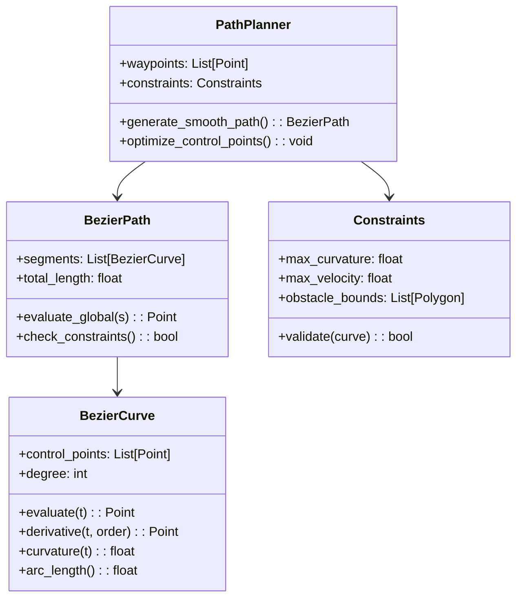

# 代码实现理论指导

## 实现架构

本模块的代码实现遵循模块化设计原则，将Bezier曲线路径规划分解为多个功能模块。

### 核心类设计



## 算法实现流程

### 1. 控制点生成算法

#### 算法1：切线方向法
```python
def generate_control_points_tangent(waypoints, alpha=0.3):
    """
    基于航点切线方向生成控制点
    
    Args:
        waypoints: 输入航点列表
        alpha: 控制点距离系数
    
    Returns:
        control_points: 每段Bezier曲线的控制点
    """
    # 计算每个航点的切线方向
    # 根据相邻航点计算切线向量
    # 生成中间控制点
```

#### 算法2：优化方法
```python
def optimize_control_points(waypoints, constraints):
    """
    通过优化方法生成最优控制点
    
    目标函数: 最小化曲率积分 + 路径长度 + 约束惩罚
    """
    # 定义目标函数
    # 设置约束条件
    # 使用梯度下降或其他优化算法
```

### 2. Bezier曲线计算

#### De Casteljau算法实现
```python
def de_casteljau(control_points, t):
    """
    使用De Casteljau算法计算Bezier曲线上的点
    
    优势：数值稳定，易于递归分割
    复杂度：O(n²)，其中n是控制点数量
    """
    # 递归二分计算
    # 返回曲线上的点坐标
```

#### 矩阵方法实现
```python
def bezier_matrix(control_points, t_values):
    """
    使用矩阵方法批量计算Bezier曲线点
    
    优势：适合批量计算，易于并行化
    复杂度：O(n*m)，其中m是采样点数量
    """
    # 构建Bezier矩阵
    # 批量矩阵乘法计算
```

### 3. 曲率计算与约束检查

#### 曲率计算公式
对于参数曲线 $\gamma(t) = [x(t), y(t)]$：

$$\kappa(t) = \frac{|x'(t)y''(t) - y'(t)x''(t)|}{(x'(t)^2 + y'(t)^2)^{3/2}}$$

#### 实现要点
```python
def compute_curvature(curve, t):
    """
    计算曲线在参数t处的曲率
    
    注意事项：
    1. 处理导数为零的奇异点
    2. 确保数值计算的稳定性
    3. 考虑浮点误差的影响
    """
    # 计算一阶导数
    # 计算二阶导数
    # 应用曲率公式
    # 异常处理
```

### 4. 路径连接与C²连续性

#### 连续性条件
要保证相邻Bezier段的C²连续性：

**位置连续（C⁰）**：
$$P_{i,3} = P_{i+1,0}$$

**切线连续（C¹）**：
$$P_{i,3} - P_{i,2} = k \cdot (P_{i+1,1} - P_{i+1,0})$$

**曲率连续（C²）**：
$$P_{i,1} - 2P_{i,2} + P_{i,3} = k² \cdot (P_{i+1,0} - 2P_{i+1,1} + P_{i+1,2})$$

#### 实现策略
```python
def ensure_continuity(segments):
    """
    确保Bezier段之间的连续性
    
    方法：
    1. 固定端点位置（C⁰）
    2. 调整控制点确保切线连续（C¹）
    3. 进一步调整确保曲率连续（C²）
    """
    # 遍历相邻段
    # 应用连续性约束
    # 更新控制点位置
```

## 数据结构设计

### Point类
```python
@dataclass
class Point:
    x: float
    y: float
    z: float = 0.0
    
    def distance_to(self, other): ...
    def dot(self, other): ...
    def cross(self, other): ...
```

### BezierCurve类
```python
class BezierCurve:
    def __init__(self, control_points):
        self.control_points = control_points
        self.degree = len(control_points) - 1
        
    def evaluate(self, t): ...
    def derivative(self, t, order=1): ...
    def curvature(self, t): ...
    def split(self, t): ...  # 曲线分割
```

## 性能优化考虑

### 1. 计算优化
- **预计算**：Bernstein基函数系数
- **缓存**：常用的导数值
- **并行**：多段Bezier曲线并行计算
- **近似**：低精度预览和高精度最终计算

### 2. 内存优化
- **惰性计算**：只在需要时计算曲线点
- **采样适配**：根据曲率调整采样密度
- **数据压缩**：控制点的紧凑存储

### 3. 数值稳定性
- **参数范围检查**：确保t∈[0,1]
- **除零保护**：曲率计算中的分母检查
- **精度控制**：浮点比较的容差设置

## 错误处理与鲁棒性

### 常见问题及处理

1. **控制点共线**：检测并调整控制点位置
2. **约束违反**：提供降级方案或警告
3. **数值奇异**：使用替代算法或插值方法
4. **性能瓶颈**：提供简化模式和详细模式

### 调试辅助功能

```python
def debug_curve_properties(curve):
    """
    输出曲线的关键属性用于调试
    
    包括：
    - 控制点坐标
    - 曲线长度
    - 最大曲率位置和值
    - 连续性检查结果
    """
```

## 测试策略

### 单元测试
- Bezier曲线计算精度测试
- 导数计算正确性验证
- 约束检查功能测试

### 集成测试
- 端到端路径生成测试
- 不同航点配置的鲁棒性测试
- 性能基准测试

### 可视化测试
- 生成的轨迹可视化
- 曲率分布图
- 约束满足情况展示 