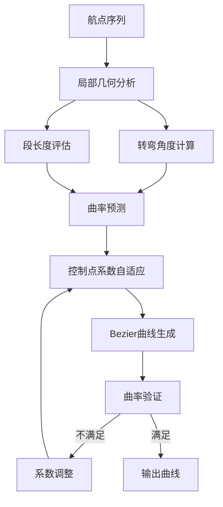
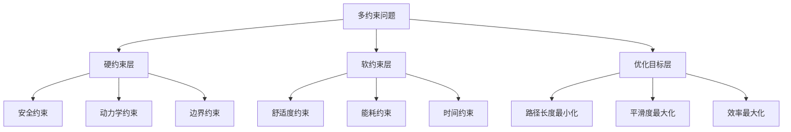
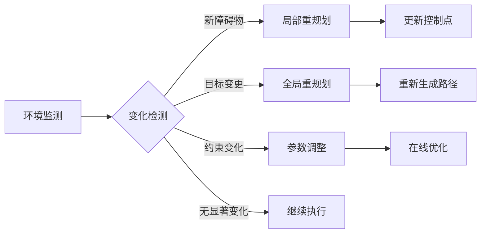
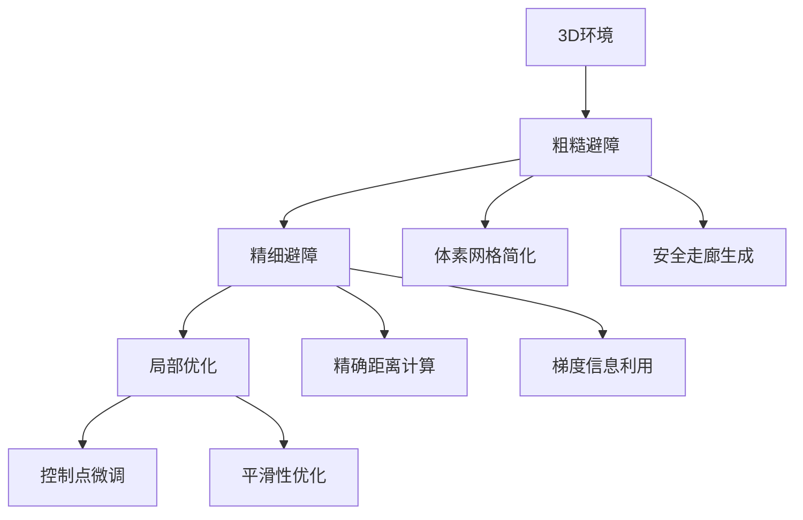
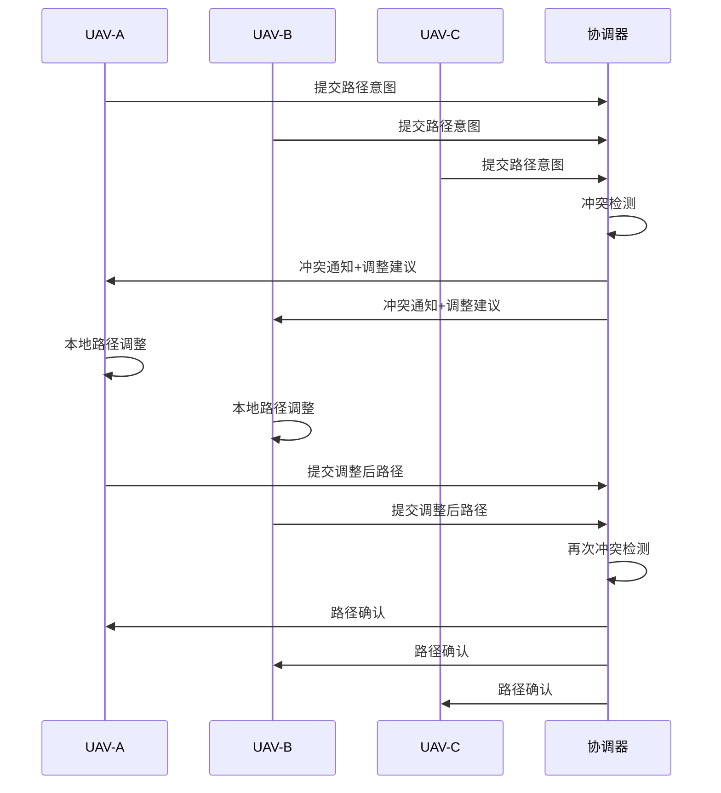
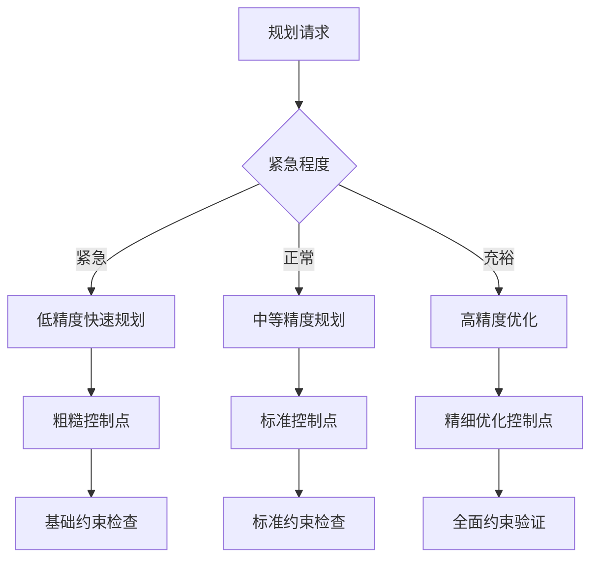
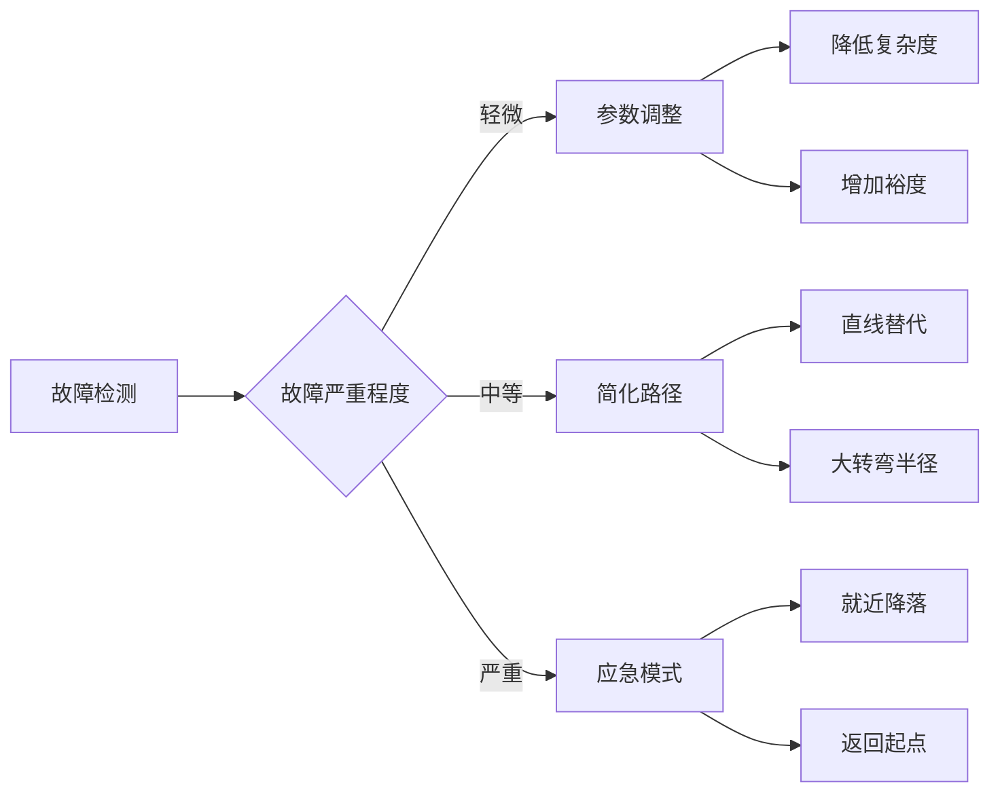

# Bezier曲线路径规划高级特性

## 概述

本模块深入探讨Bezier曲线路径规划的高级特性和优化技术，包括自适应控制点选择、多约束优化、动态重规划、地形感知以及与机器学习的结合应用。这些高级特性使Bezier曲线能够应对更复杂的实际应用场景。

## 1. 自适应控制点选择

### 1.1 基于曲率预测的控制点调整

传统的固定系数方法可能导致在复杂路径中产生过大或过小的曲率。自适应方法根据局部几何特征动态调整控制点位置。

#### 曲率预测模型



**转弯角度计算**：
$$\theta_i = \arccos\left(\frac{\overrightarrow{w_{i-1}w_i} \cdot \overrightarrow{w_i w_{i+1}}}{\|\overrightarrow{w_{i-1}w_i}\| \|\overrightarrow{w_i w_{i+1}}\|}\right)$$

**自适应系数**：
$$\alpha_i = \alpha_{base} \cdot f(\theta_i, d_i, \kappa_{max})$$

其中：
- $f(\theta_i, d_i, \kappa_{max})$ 是基于转弯角、段长度和最大曲率限制的调整函数
- 典型形式：$f = \frac{1}{1 + k_1 |\theta_i - \pi| + k_2/d_i}$

### 1.2 机器学习辅助的控制点优化

#### 神经网络预测模型

使用神经网络学习从航点配置到最优控制点的映射关系：

**输入特征**：
- 航点坐标序列
- 局部几何特征（转弯角、段长度等）
- 约束参数（最大曲率、速度等）
- 环境信息（障碍物分布等）

**网络架构**：
```
输入层(n×3) → LSTM(128) → Dense(64) → Dense(32) → 输出层(m×2)
```

其中输出为每个控制点的调整增量。

**训练数据生成**：
```python
def generate_training_data(num_samples=10000):
    training_data = []
    for _ in range(num_samples):
        # 随机生成航点配置
        waypoints = generate_random_waypoints()
        
        # 使用优化算法找到最优控制点
        optimal_controls = optimize_control_points(waypoints)
        
        # 提取特征
        features = extract_features(waypoints)
        
        training_data.append((features, optimal_controls))
    
    return training_data
```

### 1.3 基于强化学习的动态调整

将控制点选择建模为马尔可夫决策过程：

**状态空间**：
- 当前航点配置
- 环境状态（障碍物、地形等）
- 约束满足情况

**动作空间**：
- 控制点位置的微调
- 系数参数的调整

**奖励函数**：
$$R = w_1 R_{smooth} + w_2 R_{constraint} + w_3 R_{efficiency} + w_4 R_{safety}$$

其中：
- $R_{smooth}$：平滑度奖励
- $R_{constraint}$：约束满足奖励
- $R_{efficiency}$：效率奖励（路径长度、时间等）
- $R_{safety}$：安全性奖励

## 2. 多约束优化框架

### 2.1 约束分层处理

将复杂的多约束问题分解为分层优化：



#### 约束数学表达

**硬约束（必须满足）**：
- 曲率约束：$\kappa(t) \leq \kappa_{max}, \forall t \in [0,1]$
- 碰撞约束：$\|\mathbf{r}(t) - \mathbf{o}_i\| \geq r_{safe}, \forall i$
- 边界约束：$\mathbf{r}(0) = \mathbf{w}_0, \mathbf{r}(1) = \mathbf{w}_n$

**软约束（尽量满足）**：
- 加速度约束：$\|\mathbf{r}''(t)\| \leq a_{max}$
- 能耗约束：$\int_0^1 E(\mathbf{r}'(t)) dt \leq E_{max}$

### 2.2 鲁棒优化方法

考虑参数不确定性的鲁棒优化：

**不确定性集合**：
$$\mathcal{U} = \{\boldsymbol{\xi} : \|\boldsymbol{\xi} - \boldsymbol{\xi}_0\|_\infty \leq \epsilon\}$$

**鲁棒约束**：
$$\max_{\boldsymbol{\xi} \in \mathcal{U}} g(\mathbf{x}, \boldsymbol{\xi}) \leq 0$$

其中 $\boldsymbol{\xi}$ 包含不确定参数如风速、传感器误差等。

### 2.3 多目标优化

使用Pareto优化处理冲突目标：

**目标函数向量**：
$$\mathbf{f}(\mathbf{x}) = [f_1(\mathbf{x}), f_2(\mathbf{x}), ..., f_k(\mathbf{x})]^T$$

**Pareto最优条件**：
路径 $\mathbf{x}^*$ 是Pareto最优的，当且仅当不存在另一路径 $\mathbf{x}$ 使得：
$$f_i(\mathbf{x}) \leq f_i(\mathbf{x}^*), \forall i \text{ 且 } f_j(\mathbf{x}) < f_j(\mathbf{x}^*), \exists j$$

## 3. 动态环境适应

### 3.1 实时重规划策略

#### 触发条件



**变化检测算法**：
```python
def detect_environment_change(current_state, previous_state, threshold=0.1):
    # 障碍物变化检测
    obstacle_change = compute_obstacle_difference(
        current_state.obstacles, previous_state.obstacles)
    
    # 目标位置变化
    goal_change = distance(current_state.goal, previous_state.goal)
    
    # 约束参数变化
    constraint_change = compute_constraint_difference(
        current_state.constraints, previous_state.constraints)
    
    return (obstacle_change > threshold or 
            goal_change > threshold or 
            constraint_change > threshold)
```

#### 增量式更新

避免完全重新计算，使用增量式更新：

**局部调整**：
只更新受影响的Bezier段：
```python
def incremental_update(path, changed_region):
    affected_segments = find_affected_segments(path, changed_region)
    
    for segment_idx in affected_segments:
        # 保持连续性约束
        continuity_constraints = extract_continuity_constraints(
            path, segment_idx)
        
        # 局部重优化
        new_segment = optimize_segment(
            segment_idx, continuity_constraints)
        
        path.update_segment(segment_idx, new_segment)
    
    return path
```

### 3.2 预测性规划

基于环境预测进行前瞻性规划：

#### 动态障碍物预测

**运动模型**：
- 恒速模型：$\mathbf{p}_{t+\Delta t} = \mathbf{p}_t + \mathbf{v}_t \Delta t$
- 恒加速模型：$\mathbf{p}_{t+\Delta t} = \mathbf{p}_t + \mathbf{v}_t \Delta t + \frac{1}{2}\mathbf{a}_t \Delta t^2$
- 机器学习模型：使用LSTM预测复杂运动模式

**不确定性量化**：
$$\mathbf{p}_{predicted} \sim \mathcal{N}(\boldsymbol{\mu}_{pred}, \boldsymbol{\Sigma}_{pred})$$

#### 风场预测与补偿

**风场模型**：
$$\mathbf{v}_{wind}(x, y, z, t) = \mathbf{v}_{mean} + \mathbf{v}_{turbulence}(t)$$

**轨迹补偿**：
$$\mathbf{r}_{compensated}(t) = \mathbf{r}_{nominal}(t) + \int_0^t \mathbf{v}_{wind}(\mathbf{r}(\tau), \tau) d\tau$$

## 4. 地形感知与避障

### 4.1 地形自适应飞行

#### 地形跟随模式

**高度控制策略**：
```python
def terrain_following_height(position, terrain_map, safety_margin=50):
    terrain_height = terrain_map.get_height(position.x, position.y)
    
    # 前视地形分析
    look_ahead_distance = 200  # 米
    max_terrain_ahead = terrain_map.get_max_height_in_region(
        position.x, position.y, look_ahead_distance)
    
    # 计算所需飞行高度
    required_height = max(terrain_height, max_terrain_ahead) + safety_margin
    
    return required_height
```

**坡度适应控制点**：
根据地形坡度调整控制点的垂直分量：

$$z_{control} = z_{waypoint} + \Delta z_{slope} + \Delta z_{safety}$$

其中：
$$\Delta z_{slope} = \alpha \cdot \nabla z_{terrain} \cdot \Delta \mathbf{r}_{horizontal}$$

### 4.2 复杂3D避障

#### 层次化避障策略



#### 安全走廊方法

**走廊生成**：
1. 使用Voronoi图或距离场生成基础走廊
2. 膨胀走廊边界以确保安全裕度
3. 在走廊内优化Bezier路径

**数学表达**：
$$\mathbf{r}(t) \in \mathcal{C}(t), \forall t \in [0,1]$$

其中 $\mathcal{C}(t)$ 是时变的安全走廊。

### 4.3 动态避障

#### 速度障碍法集成

将速度障碍法与Bezier规划结合：

**速度障碍**：
$$VO_{A,B} = \{v_A : \exists t > 0, p_A + t \cdot v_A \in B \oplus (-A)\}$$

**Bezier轨迹约束**：
$$\mathbf{r}'(t) \notin VO_{UAV,Obstacle}, \forall t$$

## 5. 能耗优化

### 5.1 能耗模型

#### 固定翼无人机能耗模型

**基础能耗模型**：
$$P_{total} = P_{propulsion} + P_{avionics} + P_{payload}$$

**推进功率模型**：
$$P_{propulsion} = \frac{1}{\eta} \left( P_{induced} + P_{profile} + P_{parasite} \right)$$

其中：
- $P_{induced} = \frac{mg^2}{2\rho \pi R^2 V}$（诱导阻力功率）
- $P_{profile} = \frac{1}{8} \rho \sigma C_{d0} \pi R^2 V^3$（型阻功率）
- $P_{parasite} = \frac{1}{2} \rho S C_{D0} V^3$（寄生阻力功率）

#### 路径相关能耗

**爬升能耗**：
$$E_{climb} = \int_0^T mg \frac{dh}{dt} dt = mg \Delta h$$

**转弯能耗**：
$$E_{turn} = \int_0^T \frac{1}{2} m v^2 \kappa(t) \sin(\phi(t)) dt$$

### 5.2 能耗优化策略

#### 高度轮廓优化

```python
def optimize_altitude_profile(horizontal_path, wind_field, terrain):
    def energy_cost(altitude_profile):
        total_energy = 0
        for i in range(len(altitude_profile)-1):
            # 爬升/下降能耗
            climb_energy = compute_climb_energy(
                altitude_profile[i], altitude_profile[i+1])
            
            # 抗风能耗
            wind_resistance_energy = compute_wind_resistance(
                horizontal_path[i], altitude_profile[i], wind_field)
            
            total_energy += climb_energy + wind_resistance_energy
        
        return total_energy
    
    # 约束条件
    constraints = [
        altitude_constraint(terrain),
        climb_rate_constraint(),
        safety_altitude_constraint()
    ]
    
    # 优化求解
    optimal_altitude = optimize(energy_cost, constraints)
    return optimal_altitude
```

#### 速度轮廓优化

**能耗最优速度**：
通过求解能耗函数的最小值确定最优巡航速度：

$$\frac{dP_{total}}{dV} = 0$$

**动态速度调整**：
根据风场和地形动态调整速度轮廓：

```python
def dynamic_speed_optimization(path, wind_field):
    speed_profile = []
    for point in path.points:
        # 获取当前位置的风速
        wind_vector = wind_field.get_wind(point)
        
        # 计算最优地速
        optimal_airspeed = compute_optimal_airspeed(wind_vector)
        optimal_groundspeed = optimal_airspeed + wind_vector.component_along_path
        
        speed_profile.append(optimal_groundspeed)
    
    return speed_profile
```

## 6. 多机协同路径规划

### 6.1 分布式Bezier规划

#### 协商机制



#### 时空分离保证

**安全距离约束**：
$$\|\mathbf{r}_i(t) - \mathbf{r}_j(t)\| \geq d_{safe}, \forall t, i \neq j$$

**时间窗口分配**：
为每个无人机分配时间窗口，避免同时占用相同空域：

```python
def allocate_time_windows(paths, safe_distance):
    conflicts = detect_spatial_conflicts(paths, safe_distance)
    
    for conflict in conflicts:
        uav_i, uav_j, conflict_region = conflict
        
        # 计算通过冲突区域的时间
        time_i = compute_transit_time(paths[uav_i], conflict_region)
        time_j = compute_transit_time(paths[uav_j], conflict_region)
        
        # 调整其中一个无人机的时序
        if time_i.start < time_j.start:
            adjust_timing(paths[uav_j], time_i.end + safety_margin)
        else:
            adjust_timing(paths[uav_i], time_j.end + safety_margin)
    
    return paths
```

### 6.2 编队飞行优化

#### 编队构型维护

**虚拟结构法**：
$$\mathbf{r}_i(t) = \mathbf{r}_{leader}(t) + \mathbf{R}(t) \mathbf{d}_i$$

其中：
- $\mathbf{r}_{leader}(t)$ 是长机轨迹
- $\mathbf{R}(t)$ 是编队姿态矩阵
- $\mathbf{d}_i$ 是第i架飞机的相对位置

**Bezier编队轨迹**：
```python
def generate_formation_trajectories(leader_path, formation_config):
    formation_paths = {}
    
    for uav_id, relative_position in formation_config.items():
        follower_waypoints = []
        
        for waypoint in leader_path.waypoints:
            # 计算跟随者对应位置
            follower_pos = transform_position(waypoint, relative_position)
            follower_waypoints.append(follower_pos)
        
        # 为跟随者生成Bezier路径
        follower_path = generate_bezier_path(follower_waypoints)
        formation_paths[uav_id] = follower_path
    
    return formation_paths
```

## 7. 实时性能优化

### 7.1 计算加速技术

#### GPU并行计算

```python
import cupy as cp  # GPU加速NumPy

def gpu_bezier_evaluation(control_points_gpu, t_values_gpu):
    """GPU加速的Bezier曲线批量计算"""
    n = control_points_gpu.shape[0] - 1  # 曲线阶数
    
    # 并行计算Bernstein基函数
    bernstein_basis = cp.zeros((len(t_values_gpu), n+1))
    for i in range(n+1):
        bernstein_basis[:, i] = (
            cp.math.comb(n, i) * 
            cp.power(1 - t_values_gpu, n - i) * 
            cp.power(t_values_gpu, i)
        )
    
    # 矩阵乘法计算曲线点
    curve_points = cp.dot(bernstein_basis, control_points_gpu)
    
    return curve_points.get()  # 转回CPU
```

#### 近似算法

**分段线性近似**：
在约束检查中使用快速的分段线性近似：

```python
def fast_constraint_check(bezier_curve, constraints, num_segments=20):
    """快速约束检查：使用分段线性近似"""
    t_values = np.linspace(0, 1, num_segments + 1)
    
    # 计算关键点
    key_points = [bezier_curve.evaluate(t) for t in t_values]
    
    # 线性段约束检查
    for i in range(len(key_points) - 1):
        if not constraints.check_segment(key_points[i], key_points[i+1]):
            return False
    
    return True
```

### 7.2 自适应精度控制

#### 分层精度策略



#### 错误控制与精度提升

```python
def adaptive_precision_planning(waypoints, time_budget, min_quality):
    start_time = time.time()
    
    # 第一阶段：快速粗糙规划
    rough_path = generate_rough_bezier_path(waypoints)
    
    # 检查时间和质量
    elapsed_time = time.time() - start_time
    current_quality = evaluate_path_quality(rough_path)
    
    if elapsed_time > time_budget * 0.8 or current_quality >= min_quality:
        return rough_path
    
    # 第二阶段：精度提升
    refined_path = refine_bezier_path(rough_path, waypoints)
    
    elapsed_time = time.time() - start_time
    if elapsed_time > time_budget * 0.95:
        return refined_path
    
    # 第三阶段：优化
    optimized_path = optimize_bezier_path(refined_path, waypoints)
    
    return optimized_path
```

## 8. 故障恢复与安全机制

### 8.1 路径退化策略

#### 故障检测

```python
def detect_path_following_failure(planned_path, actual_trajectory, threshold):
    """检测路径跟踪失败"""
    
    # 计算横向偏差
    lateral_errors = []
    for point in actual_trajectory:
        closest_point = planned_path.find_closest_point(point)
        lateral_error = point.distance_to(closest_point)
        lateral_errors.append(lateral_error)
    
    # 统计分析
    max_error = max(lateral_errors)
    mean_error = np.mean(lateral_errors)
    
    return (max_error > threshold.max_lateral_error or 
            mean_error > threshold.mean_lateral_error)
```

#### 安全退化方案



### 8.2 冗余路径规划

#### 多候选路径

```python
def generate_redundant_paths(waypoints, constraints, num_candidates=3):
    """生成多条候选路径"""
    
    candidate_paths = []
    
    for i in range(num_candidates):
        # 使用不同的策略参数
        alpha = 0.2 + i * 0.2  # 不同的控制点系数
        noise_level = i * 0.1   # 不同的随机扰动
        
        # 添加随机扰动到航点
        perturbed_waypoints = add_noise(waypoints, noise_level)
        
        # 生成路径
        path = generate_bezier_path(perturbed_waypoints, alpha=alpha)
        
        # 验证路径可行性
        if validate_path(path, constraints):
            candidate_paths.append(path)
    
    return candidate_paths
```

#### 实时路径切换

```python
def adaptive_path_switching(current_path, candidate_paths, flight_state):
    """根据飞行状态自适应切换路径"""
    
    # 评估当前路径性能
    current_performance = evaluate_path_performance(current_path, flight_state)
    
    # 检查是否需要切换
    if current_performance < PERFORMANCE_THRESHOLD:
        
        # 评估所有候选路径
        best_path = current_path
        best_score = current_performance
        
        for candidate in candidate_paths:
            score = evaluate_path_performance(candidate, flight_state)
            if score > best_score:
                best_path = candidate
                best_score = score
        
        # 确保切换的平滑性
        if best_path != current_path:
            smooth_transition_path = create_transition_path(
                current_path, best_path, flight_state.current_position)
            return smooth_transition_path
    
    return current_path
```

## 9. 性能监控与调优

### 9.1 实时性能指标

#### 关键性能指标（KPI）

```python
class PathPlanningKPI:
    def __init__(self):
        self.computation_time = []
        self.path_quality_scores = []
        self.constraint_violations = []
        self.memory_usage = []
        
    def update_metrics(self, planning_result):
        self.computation_time.append(planning_result.computation_time)
        self.path_quality_scores.append(planning_result.quality_score)
        self.constraint_violations.append(planning_result.violations)
        self.memory_usage.append(planning_result.memory_usage)
    
    def get_performance_summary(self):
        return {
            'avg_computation_time': np.mean(self.computation_time),
            'max_computation_time': np.max(self.computation_time),
            'avg_quality_score': np.mean(self.path_quality_scores),
            'violation_rate': np.mean(self.constraint_violations),
            'avg_memory_usage': np.mean(self.memory_usage)
        }
```

### 9.2 自适应参数调优

#### 在线学习调优

```python
def online_parameter_tuning(parameter_history, performance_history):
    """基于历史性能的在线参数调优"""
    
    # 使用强化学习更新参数
    q_learning_agent = QLearningAgent(
        state_space_size=len(parameter_history[0]),
        action_space_size=21,  # -1.0到1.0，步长0.1
        learning_rate=0.1,
        discount_factor=0.95
    )
    
    # 训练智能体
    for params, performance in zip(parameter_history, performance_history):
        state = discretize_parameters(params)
        reward = normalize_performance(performance)
        
        q_learning_agent.update(state, reward)
    
    # 获取优化建议
    current_state = discretize_parameters(parameter_history[-1])
    optimal_action = q_learning_agent.get_best_action(current_state)
    
    # 转换为参数调整
    parameter_adjustment = action_to_parameter_change(optimal_action)
    
    return parameter_adjustment
```

## 10. 总结与展望

### 10.1 高级特性总结

本模块介绍的高级特性为Bezier曲线路径规划提供了强大的扩展能力：

1. **智能化**：机器学习辅助的控制点选择和参数优化
2. **鲁棒性**：多约束优化和故障恢复机制
3. **适应性**：动态环境感知和实时重规划
4. **协同性**：多机协同和编队飞行支持
5. **高效性**：计算加速和实时性能优化

### 10.2 技术发展趋势

未来的发展方向包括：

- **深度学习集成**：端到端的深度学习路径规划
- **量子计算应用**：量子优化算法求解复杂约束问题
- **边缘计算部署**：在无人机平台上的实时规划能力
- **数字孪生集成**：与数字孪生环境的深度融合

### 10.3 实际应用建议

在实际应用中，建议：

1. **渐进式部署**：从基础功能开始，逐步添加高级特性
2. **场景定制**：根据具体应用场景选择合适的高级特性组合
3. **性能监控**：建立完善的性能监控和调优机制
4. **安全优先**：始终将安全性放在首位，确保故障恢复能力

这些高级特性使Bezier曲线路径规划能够应对现代无人系统面临的复杂挑战，为实际工程应用提供了强有力的技术支撑。 