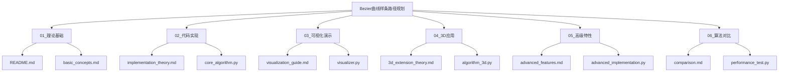

# Bezier曲线/样条路径规划教程

## 项目概述

本教程深入探讨Bezier曲线和样条在路径规划中的应用，特别是无人机航迹平滑与优化。通过理论与实践相结合的方式，帮助理解这类方法在路径规划中的核心作用：**将离散路径点转化为平滑、连续可导的航迹**。

## 教程结构



## 学习路径

1. **理论基础**: 了解Bezier曲线数学原理和路径规划应用场景
2. **代码实现**: 掌握核心算法的Python实现
3. **可视化演示**: 通过动态展示理解算法执行过程
4. **3D应用**: 扩展到三维空间的路径规划
5. **高级特性**: 学习路径优化和特殊应用技术
6. **算法对比**: 了解与其他路径规划方法的优劣比较

## 主要特点

- 🎯 **实用导向**: 重点关注无人机航迹平滑应用
- 📊 **可视化丰富**: 提供动态演示和交互式展示
- 🔧 **代码完整**: 所有算法均有完整可运行的Python实现
- 📖 **理论扎实**: 深入讲解数学原理和工程应用
- 🚀 **进阶内容**: 包含3D扩展和高级优化技术

## 快速开始

```bash
# 进入对应目录运行代码
cd 02_代码实现
python core_algorithm.py

# 查看可视化演示
cd 03_可视化演示
python visualizer.py
```

## 依赖环境

- Python 3.8+
- NumPy, Matplotlib, SciPy
- 可选: Plotly (交互式可视化) 