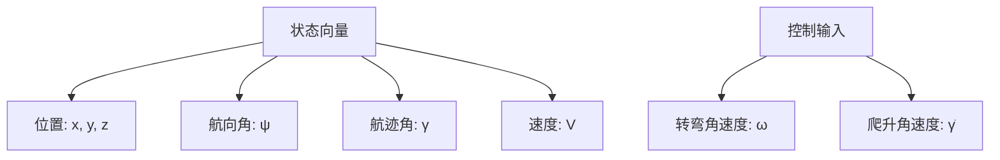
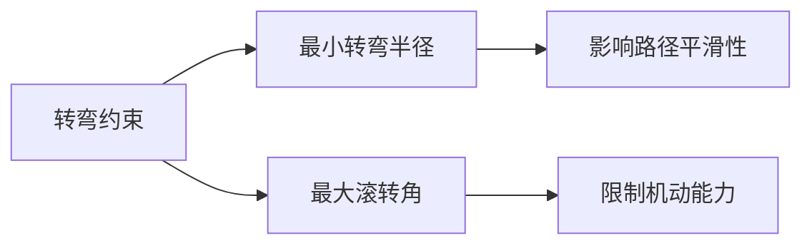
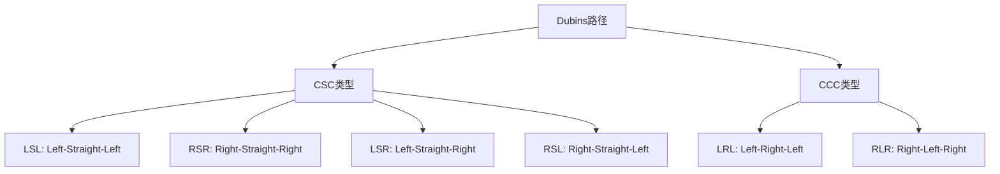
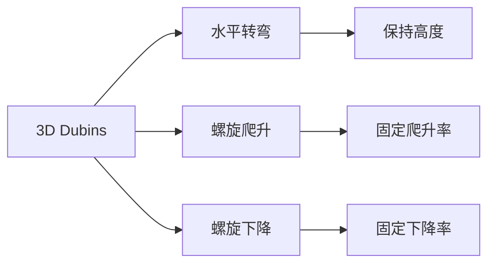
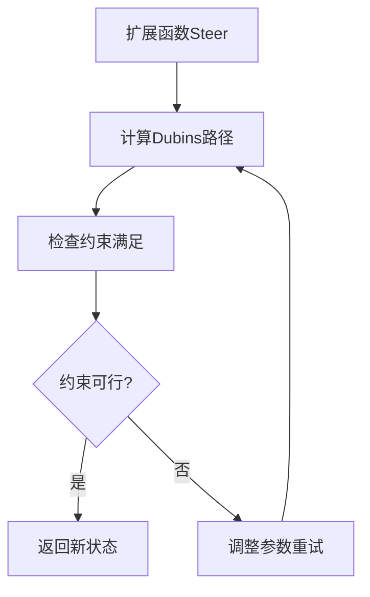
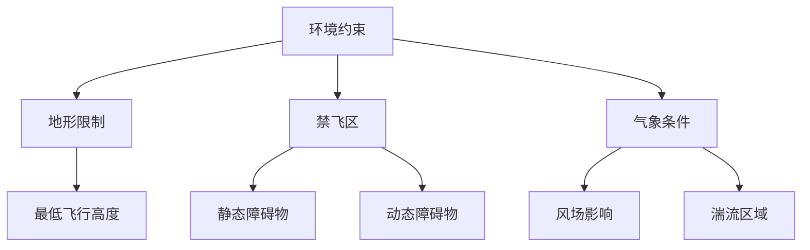
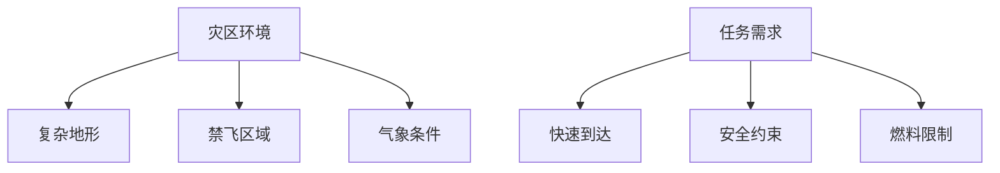

# 固定翼无人机RRT路径规划约束详解

## 📝 概述

固定翼无人机在路径规划中面临着独特的约束挑战，主要源于其**非完整性(Non-holonomic)**特征。与地面机器人不同，固定翼无人机不能任意转向，必须满足最小转弯半径、航迹角限制等约束。

## 🛩️ 固定翼无人机运动学模型

### 基本运动学方程



**状态方程:**
```math
\begin{cases}
\dot{x} = V \cos(\gamma) \cos(\psi) \\
\dot{y} = V \cos(\gamma) \sin(\psi) \\
\dot{z} = V \sin(\gamma) \\
\dot{\psi} = \frac{g \tan(\phi)}{V \cos(\gamma)} \\
\dot{\gamma} = \frac{g(\sin(\alpha) - \cos(\gamma))}{V}
\end{cases}
```

其中：
- $(x, y, z)$: 位置坐标
- $\psi$: 航向角 (Heading)
- $\gamma$: 航迹角 (Flight Path Angle)
- $V$: 空速
- $\phi$: 滚转角 (Bank Angle)
- $\alpha$: 迎角 (Angle of Attack)

## 🎯 主要约束条件

### 1. 最小转弯半径约束

**Dubins路径约束:**
```math
R_{min} = \frac{V^2}{g \tan(\phi_{max})}
```

其中：
- $R_{min}$: 最小转弯半径
- $V$: 飞行速度
- $g$: 重力加速度
- $\phi_{max}$: 最大滚转角



### 2. 爬升/下降约束

**航迹角限制:**
```math
\gamma_{min} \leq \gamma \leq \gamma_{max}
```

典型值：
- $\gamma_{max} = 15°$ (最大爬升角)
- $\gamma_{min} = -20°$ (最大下降角)

### 3. 速度约束

**失速速度限制:**
```math
V_{stall} \leq V \leq V_{max}
```

### 4. 加速度约束

**载荷因子约束:**
```math
n_{min} \leq n \leq n_{max}
```

其中载荷因子：
```math
n = \frac{L}{mg} = \frac{1}{\cos(\phi)}
```

## 🔄 Dubins路径在RRT中的应用

### Dubins路径类型



### 距离计算

对于CSC类型路径：
```math
L_{CSC} = R \cdot |\theta_1| + d + R \cdot |\theta_2|
```

对于CCC类型路径：
```math
L_{CCC} = R \cdot (|\theta_1| + |\theta_2| + |\theta_3|)
```

## 🚁 3D Dubins路径扩展

### 螺旋运动模型



**螺旋路径参数化:**
```math
\begin{cases}
x(t) = x_c + R \cos(\psi_0 + \omega t) \\
y(t) = y_c + R \sin(\psi_0 + \omega t) \\
z(t) = z_0 + V \sin(\gamma) \cdot t
\end{cases}
```

其中：
- $(x_c, y_c)$: 螺旋中心
- $R$: 转弯半径
- $\omega = V\cos(\gamma)/R$: 角速度
- $\gamma$: 航迹角

## 📊 约束下的RRT*改进

### 1. 状态采样策略

```python
def sample_state():
    """采样满足约束的状态"""
    x = uniform(x_min, x_max)
    y = uniform(y_min, y_max) 
    z = uniform(z_min, z_max)
    psi = uniform(0, 2*pi)  # 航向角
    gamma = uniform(gamma_min, gamma_max)  # 航迹角
    return [x, y, z, psi, gamma]
```

### 2. 约束扩展函数



### 3. 碰撞检测改进

**分段检测:**
```python
def collision_check_dubins(path):
    """Dubins路径碰撞检测"""
    for segment in path.segments:
        if segment.type == 'straight':
            if not line_collision_free(segment):
                return False
        else:  # circular arc
            if not arc_collision_free(segment):
                return False
    return True
```

## 🎮 实际应用参数

### 典型固定翼无人机参数

| 参数 | 符号 | 典型值 | 单位 |
|------|------|--------|------|
| 巡航速度 | $V$ | 25-30 | m/s |
| 最小转弯半径 | $R_{min}$ | 50-100 | m |
| 最大爬升角 | $\gamma_{max}$ | 15 | ° |
| 最大下降角 | $\gamma_{min}$ | -20 | ° |
| 最大滚转角 | $\phi_{max}$ | 45 | ° |

### 环境约束



## 🔧 算法优化策略

### 1. 自适应采样

根据当前树的覆盖情况调整采样策略：
```python
def adaptive_sampling(tree, obstacles):
    """自适应采样策略"""
    # 计算Voronoi图
    voronoi_regions = compute_voronoi(tree.vertices)
    
    # 在稀疏区域增加采样概率
    sparse_regions = find_sparse_regions(voronoi_regions)
    
    # 考虑约束的可达性
    reachable_regions = filter_reachable(sparse_regions)
    
    return sample_from_regions(reachable_regions)
```

### 2. 路径后处理


### 3. 多分辨率规划

```python
def multi_resolution_planning():
    """多分辨率路径规划"""
    # 粗粒度快速规划
    coarse_path = rrt_star_coarse()
    
    # 细粒度局部优化
    fine_path = refine_path(coarse_path)
    
    # 约束满足验证
    feasible_path = constraint_satisfaction(fine_path)
    
    return feasible_path
```

## 📈 性能评估指标

### 1. 路径质量
- **路径长度**: $L = \sum_{i=1}^{n-1} d(x_i, x_{i+1})$
- **平滑度**: $S = \sum_{i=1}^{n-2} |\theta_{i+1} - \theta_i|$
- **高度变化**: $H = \sum_{i=1}^{n-1} |z_{i+1} - z_i|$

### 2. 约束满足度
- **转弯半径违反**: $V_R = \max(0, R_{req} - R_{min})$
- **航迹角违反**: $V_\gamma = \max(0, |\gamma| - \gamma_{max})$

### 3. 计算效率
- **规划时间**: $T_{plan}$
- **内存使用**: $M_{usage}$
- **收敛迭代数**: $N_{iter}$

## 🎯 应用场景示例

### 1. 灾区救援


### 2. 农业植保
- **大面积覆盖**
- **避开风场干扰**
- **优化喷洒路径**

### 3. 侦察监视
- **长距离巡航**
- **隐蔽性要求**
- **多目标访问**

## 🔍 未来发展方向

### 1. 机器学习增强
```python
# 使用神经网络预测最优扩展方向
def ml_enhanced_steer(current_state, target_state):
    """机器学习增强的扩展函数"""
    features = extract_features(current_state, target_state)
    optimal_control = neural_network.predict(features)
    return apply_dubins_constraints(optimal_control)
```

### 2. 多目标优化
- **能耗最小化**
- **时间最短路径**
- **风险最小化**

### 3. 协同规划
- **多机编队**
- **任务分配**
- **冲突避免**

## 📚 参考文献

1. Dubins, L.E. "On Curves of Minimal Length with a Constraint on Average Curvature"
2. LaValle, S.M. "Rapidly-Exploring Random Trees: A New Tool for Path Planning"
3. Karaman, S. "Sampling-based Algorithms for Optimal Motion Planning"
4. Chitsaz, H. "Time-optimal Paths for a Dubins Airplane" 