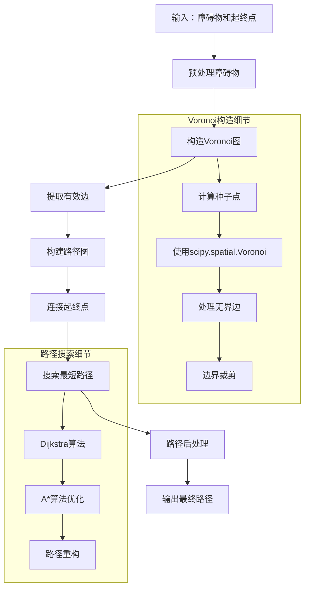
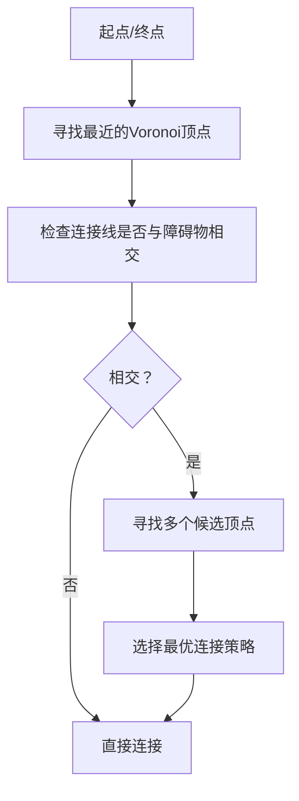

# 代码实现理论

## 实现概述

本节将展示如何使用Python实现基于Voronoi图的路径规划算法。我们将分步骤构建完整的系统，包括：

1. Voronoi图的构造
2. 路径图的生成
3. 最短路径搜索
4. 起终点连接

## 核心数据结构

### 1. 点和障碍物表示

```python
# 点的表示
Point = namedtuple('Point', ['x', 'y'])

# 障碍物表示（圆形）
Obstacle = namedtuple('Obstacle', ['center', 'radius'])

# 障碍物表示（多边形）
PolygonObstacle = namedtuple('PolygonObstacle', ['vertices'])
```

### 2. Voronoi图数据结构

```python
class VoronoiGraph:
    def __init__(self):
        self.vertices = []      # Voronoi顶点
        self.edges = []         # Voronoi边
        self.cells = []         # Voronoi单元
        self.adjacency = {}     # 邻接表
```

## 算法流程



## 关键算法详解

### 1. Voronoi图构造

我们使用SciPy库中的`spatial.Voronoi`来构造Voronoi图：

```python
from scipy.spatial import Voronoi

def construct_voronoi(obstacles, bounds):
    # 提取障碍物中心点作为种子点
    seed_points = [obs.center for obs in obstacles]
    
    # 添加边界点确保有界Voronoi图
    boundary_points = generate_boundary_points(bounds)
    all_points = seed_points + boundary_points
    
    # 构造Voronoi图
    vor = Voronoi(all_points)
    
    return vor
```

### 2. 有效边提取

并非所有Voronoi边都适合作为路径，需要过滤：

```python
def extract_valid_edges(vor, obstacles, bounds):
    valid_edges = []
    
    for edge in vor.ridge_vertices:
        if -1 in edge:  # 跳过无界边
            continue
            
        vertex1 = vor.vertices[edge[0]]
        vertex2 = vor.vertices[edge[1]]
        
        # 检查边是否在边界内且不与障碍物相交
        if (is_within_bounds(vertex1, bounds) and 
            is_within_bounds(vertex2, bounds) and
            not intersects_obstacles(vertex1, vertex2, obstacles)):
            valid_edges.append((vertex1, vertex2))
    
    return valid_edges
```

### 3. 路径图构建

将Voronoi边转换为图结构：

```python
import networkx as nx

def build_path_graph(valid_edges):
    G = nx.Graph()
    
    for edge in valid_edges:
        v1, v2 = edge
        # 计算边的欧氏距离作为权重
        weight = euclidean_distance(v1, v2)
        G.add_edge(v1, v2, weight=weight)
    
    return G
```

### 4. 起终点连接策略



### 5. 最短路径搜索

使用Dijkstra算法或A*算法：

```python
def find_shortest_path(graph, start, goal):
    try:
        # 使用NetworkX的最短路径算法
        path = nx.shortest_path(graph, start, goal, weight='weight')
        distance = nx.shortest_path_length(graph, start, goal, weight='weight')
        return path, distance
    except nx.NetworkXNoPath:
        return None, float('inf')
```

## 性能优化策略

### 1. 空间索引
使用KD树或R树加速邻近查询：

```python
from scipy.spatial import KDTree

class VoronoiPathPlanner:
    def __init__(self, obstacles, bounds):
        self.obstacles = obstacles
        self.bounds = bounds
        self.obstacle_tree = None
        self.setup_spatial_index()
    
    def setup_spatial_index(self):
        obstacle_points = [obs.center for obs in self.obstacles]
        self.obstacle_tree = KDTree(obstacle_points)
```

### 2. 增量构造
对于动态环境，支持增量更新：

```python
def update_voronoi(self, new_obstacles, removed_obstacles):
    # 增量更新Voronoi图
    if len(new_obstacles) < len(self.obstacles) * 0.1:
        # 局部重构
        self.incremental_update(new_obstacles, removed_obstacles)
    else:
        # 全局重构
        self.full_reconstruction()
```

### 3. 并行计算
对于大规模障碍物环境：

```python
from multiprocessing import Pool

def parallel_edge_validation(edges, obstacles):
    with Pool() as pool:
        results = pool.starmap(validate_edge, 
                              [(edge, obstacles) for edge in edges])
    return [edge for edge, valid in zip(edges, results) if valid]
```

## 误差处理和鲁棒性

### 1. 数值稳定性
处理浮点数精度问题：

```python
EPSILON = 1e-9

def is_point_equal(p1, p2, tolerance=EPSILON):
    return (abs(p1.x - p2.x) < tolerance and 
            abs(p1.y - p2.y) < tolerance)
```

### 2. 边界情况处理
- 无可行路径的情况
- 起终点在障碍物内的情况
- Voronoi图退化的情况

### 3. 参数调优
关键参数包括：
- 边界扩展距离
- 障碍物安全距离
- 路径平滑参数

## 复杂度分析

### 时间复杂度
- Voronoi构造: $O(n \log n)$
- 边验证: $O(m \cdot k)$，其中m是边数，k是障碍物数量
- 路径搜索: $O((V + E) \log V)$，使用Dijkstra算法

### 空间复杂度
- Voronoi图存储: $O(n)$
- 路径图存储: $O(V + E)$
- 总空间复杂度: $O(n + V + E)$

## 下一步

完成理论学习后，请查看：
- `core_voronoi.py`: 核心Voronoi图构造实现
- `path_finder.py`: 路径搜索算法实现

这些文件包含了完整的、可运行的代码实现。 