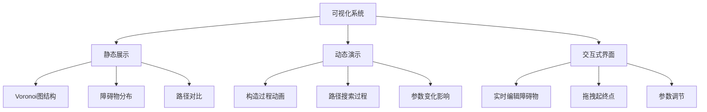

# Voronoi图路径规划可视化演示

## 概述

本部分提供了丰富的可视化工具，帮助理解Voronoi图路径规划算法的工作原理。通过动态演示和交互式界面，您可以直观地观察算法的每个步骤。

## 可视化内容

### 1. 基础可视化组件



### 2. 关键可视化特性

- **层次化显示**: 分层展示Voronoi图、障碍物、路径等元素
- **颜色编码**: 使用不同颜色区分安全区域、危险区域和路径
- **动态更新**: 实时响应参数变化和环境修改
- **多视角对比**: 同时展示多种算法结果

## 文件说明

### voronoi_visualizer.py
核心可视化类，提供：
- Voronoi图绘制
- 路径动画展示
- 多种可视化模式
- 图例和标注

### interactive_demo.py
交互式演示程序，支持：
- 鼠标交互编辑
- 实时参数调节
- 多场景切换
- 性能分析图表

### animation_demo.py
动画演示程序，展示：
- 算法执行过程
- 路径构建步骤
- 参数敏感性分析

## 可视化模式

### 1. 基础模式
显示基本的Voronoi图和路径规划结果

### 2. 详细模式  
展示算法的详细执行过程，包括：
- Voronoi顶点和边
- 图的构建过程
- 路径搜索步骤

### 3. 对比模式
同时展示多种路径规划方法的结果

### 4. 分析模式
提供性能分析和参数敏感性图表

## 颜色方案

| 元素 | 颜色 | 说明 |
|------|------|------|
| 障碍物 | 红色 | 不可通行区域 |
| Voronoi边 | 蓝色 | 安全通道骨架 |
| 规划路径 | 绿色 | 最终规划路径 |
| 起点 | 绿色圆圈 | 路径起始点 |
| 终点 | 红色方块 | 路径目标点 |
| Voronoi顶点 | 蓝色点 | 图的节点 |
| 边界 | 黑色 | 环境边界 |

## 使用方法

### 基本可视化
```python
from voronoi_visualizer import VoronoiVisualizer
from core_voronoi import VoronoiPathPlanner, Point

# 创建规划器和可视化器
planner = VoronoiPathPlanner(bounds=(0, 0, 20, 15))
visualizer = VoronoiVisualizer(planner)

# 添加障碍物
planner.add_obstacles([(5, 5, 1.5), (12, 8, 2.0)])

# 规划路径
path, _ = planner.plan_path(Point(1, 1), Point(19, 14))

# 可视化
visualizer.show_planning_result(path)
```

### 交互式演示
```python
from interactive_demo import InteractiveDemo

# 启动交互式界面
demo = InteractiveDemo()
demo.run()
```

### 动画演示
```python
from animation_demo import AnimationDemo

# 创建动画
demo = AnimationDemo()
demo.show_construction_animation()
demo.show_pathfinding_animation()
```

## 高级特性

### 1. 自定义渲染
支持自定义颜色、线型、标记等视觉元素

### 2. 导出功能
- 保存为高质量图片
- 导出为视频动画
- 生成PDF报告

### 3. 性能可视化
- 算法执行时间分析
- 内存使用情况
- 路径质量指标

### 4. 3D可视化预览
为3D扩展提供可视化支持

## 常见问题

### Q1: 如何调整图形显示大小？
在创建可视化器时设置figsize参数：
```python
visualizer = VoronoiVisualizer(planner, figsize=(15, 10))
```

### Q2: 如何保存可视化结果？
使用save_figure方法：
```python
visualizer.save_figure("result.png", dpi=300)
```

### Q3: 如何自定义颜色方案？
通过设置color_scheme参数：
```python
colors = {
    'obstacle': 'orange',
    'path': 'purple',
    'voronoi_edge': 'cyan'
}
visualizer.set_color_scheme(colors)
```

## 性能优化

### 1. 大规模数据可视化
- 使用数据采样减少绘制点数
- 启用硬件加速渲染
- 分层次显示细节

### 2. 实时交互优化
- 缓存计算结果
- 增量更新显示
- 后台异步计算

### 3. 内存管理
- 及时释放图形资源
- 使用轻量级数据结构
- 控制动画帧数

## 下一步

1. 运行 `voronoi_visualizer.py` 查看基础可视化效果
2. 尝试 `interactive_demo.py` 体验交互式功能  
3. 观看 `animation_demo.py` 的动画演示
4. 进入 `04_3D应用/` 探索三维扩展 