# Voronoi图法路径规划教程

## 项目概述

本教程深入讲解基于Voronoi图的路径规划算法，从理论基础到实际应用，提供完整的学习路径。

## 目录结构

```mermaid
graph TD
    A["Voronoi图法路径规划"] --> B["01_理论基础"]
    A --> C["02_代码实现"]
    A --> D["03_可视化演示"]
    A --> E["04_3D应用"]
    A --> F["05_高级特性"]
    A --> G["06_算法对比"]

    B --> B1["README.md"]
    B --> B2["basic_concepts.md"]
    B --> B3["voronoi_theory.md"]
    
    C --> C1["implementation_theory.md"]
    C --> C2["core_voronoi.py"]
    C --> C3["path_finder.py"]
    
    D --> D1["visualization_guide.md"]
    D --> D2["voronoi_visualizer.py"]
    D --> D3["interactive_demo.py"]
    
    E --> E1["3d_extension_theory.md"]
    E --> E2["voronoi_3d.py"]
    
    F --> F1["advanced_features.md"]
    F --> F2["improved_voronoi.py"]
    F --> F3["dubins_integration.py"]
    
    G --> G1["comparison.md"]
    G --> G2["performance_test.py"]
```



## 特点

- 🎯 **理论与实践并重**：从数学原理到代码实现
- 🎨 **丰富的可视化**：直观展示算法过程
- 🚀 **进阶内容**：3D扩展和高级优化
- 📊 **算法对比**：横向比较多种路径规划方法

## 快速开始

1. 进入 `01_理论基础/` 了解Voronoi图基本概念
2. 查看 `02_代码实现/` 学习核心算法
3. 运行 `03_可视化演示/` 中的示例程序
4. 探索 `04_3D应用/` 和 `05_高级特性/`

## 环境要求

```bash
pip install numpy matplotlib scipy networkx
```

## 适用场景

- 无人机路径规划
- 机器人导航
- 自动驾驶路径规划
- 游戏AI寻路 