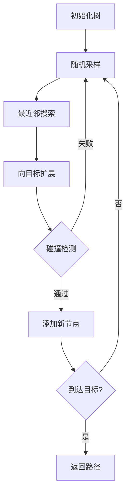
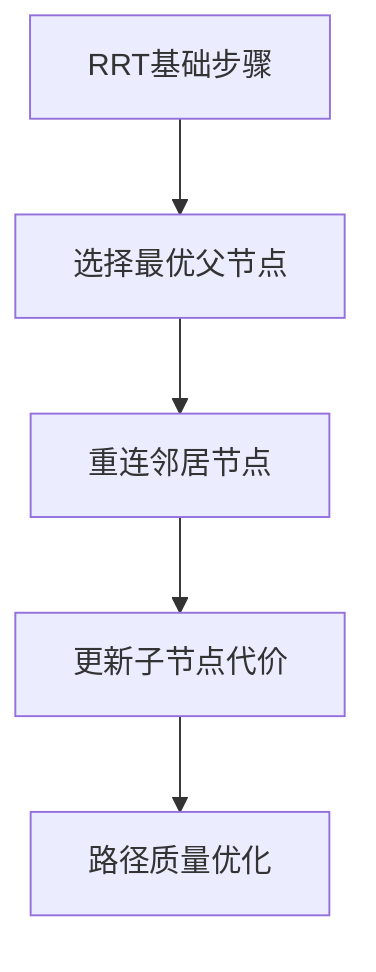

# RRT算法快速开始指南

> 🚀 **5分钟快速体验RRT算法的魅力**

## 🎯 立即开始

### 1️⃣ 环境准备
```bash
# 克隆或下载项目后进入目录
cd RRT算法详解

# 安装依赖包
pip install -r requirements.txt
```

### 2️⃣ 一键运行
```bash
# 启动交互式演示系统
python run_examples.py
```

### 3️⃣ 核心体验路径


## 🎬 演示功能一览

### 基础RRT算法
- **功能**: 快速随机采样路径规划
- **特点**: 探索速度快，适应性强
- **运行**: 选择菜单选项 1

### RRT*优化算法  
- **功能**: 渐进最优路径规划
- **特点**: 重连机制，路径质量高
- **运行**: 选择菜单选项 2

### 动态可视化
- **功能**: 实时观察算法增长过程
- **特点**: 步步展示，直观理解
- **运行**: 选择菜单选项 3

### 参数对比
- **功能**: 不同参数设置效果比较
- **特点**: 可视化参数影响
- **运行**: 选择菜单选项 4

## 📚 学习路径推荐

### 🔰 初学者路径 (第1-2天)
1. **运行基础演示** - 获得直观感受
2. **观看动画演示** - 理解算法过程  
3. **阅读理论基础** - 掌握数学原理
4. **分析基础代码** - 学习实现细节

### 🚀 进阶路径 (第3-5天)
1. **学习RRT*算法** - 理解优化机制
2. **参数调优实验** - 观察参数影响
3. **修改代码实现** - 加深理解
4. **探索算法变种** - 扩展知识面

### 🏆 高级路径 (第6-10天)
1. **3D环境应用** - 实际问题求解
2. **性能优化技巧** - 提升算法效率
3. **算法对比分析** - 选择合适方法
4. **项目实战应用** - 解决实际问题

## 🛠️ 常见问题解决

### Q1: 依赖安装失败？
```bash
# 使用清华源加速安装
pip install -r requirements.txt -i https://pypi.tuna.tsinghua.edu.cn/simple

# 或者分别安装核心包
pip install numpy matplotlib scipy
```

### Q2: 动画显示异常？
```python
# 检查matplotlib后端
import matplotlib
print(matplotlib.get_backend())

# 如有问题，可尝试切换后端
matplotlib.use('TkAgg')  # 或 'Qt5Agg'
```

### Q3: 路径规划失败？
- **检查起点终点**: 确保在自由空间内
- **调整参数**: 增大最大迭代次数或调整步长
- **简化环境**: 减少障碍物数量进行测试

### Q4: 性能优化建议？
- **使用kd-tree**: 加速最近邻搜索
- **调整采样策略**: 提高目标偏向概率
- **并行计算**: 碰撞检测可并行化

## 🎯 核心概念速览

### RRT基础流程


### RRT*改进机制


## 📁 目录导航

```
RRT算法详解/
├── 📖 01_理论基础/          # 从这里开始理解原理
│   ├── RRT算法理论基础.md   # 核心数学推导
│   └── README.md
├── 💻 02_代码实现/          # 核心算法实现
│   ├── rrt_basic.py         # 基础RRT算法
│   ├── rrt_star.py          # RRT*优化算法
│   └── README.md
├── 🎬 03_可视化演示/        # 动态演示和交互
│   ├── rrt_animation.py     # 动画演示
│   └── README.md
├── 🚁 04_3D应用/           # 三维空间应用
├── 📊 05_测试数据/         # 标准测试案例
├── 🔬 06_高级特性/         # 算法变种优化
├── ⚖️ 07_算法对比/          # 性能对比分析
├── 🚀 run_examples.py       # 一键运行脚本
├── 📦 requirements.txt      # 依赖包列表
└── 📋 README.md            # 项目主文档
```

## 🎮 交互式学习建议

### 实验1: 参数影响观察
```python
# 尝试不同步长对比
step_sizes = [0.5, 1.0, 1.5, 2.0]
# 观察路径质量和搜索效率的变化
```

### 实验2: 障碍物复杂度测试
```python
# 逐步增加障碍物数量
obstacle_counts = [3, 6, 9, 12]
# 观察算法性能变化
```

### 实验3: RRT vs RRT*对比
```python
# 相同场景下运行两种算法
# 比较路径长度和搜索时间
```

## 💡 扩展学习资源

### 📚 推荐阅读
- 《Planning Algorithms》- Steven LaValle (RRT算法发明者)
- 《Principles of Robot Motion》- Howie Choset等
- 《Robotics: Modelling, Planning and Control》- Bruno Siciliano

### 🔗 在线资源
- [RRT算法原始论文](http://lavalle.pl/papers/Lav98c.pdf)
- [RRT*算法论文](https://arxiv.org/abs/1105.1186)
- [路径规划算法合集](https://github.com/AtsushiSakai/PythonRobotics)

## 🎯 下一步行动

1. **立即行动**: 运行 `python run_examples.py`
2. **深入学习**: 阅读理论基础文档
3. **动手实践**: 修改参数观察效果
4. **扩展应用**: 尝试解决实际问题

---

**🎉 开始您的RRT算法学习之旅！**

遇到问题？查看详细文档或提交Issue获得帮助。 