# Fixed-Wing UAV RRT Path Planning Constraints Detailed Analysis

## 📝 Overview

Fixed-wing UAVs face unique constraint challenges in path planning, primarily stemming from their **non-holonomic** characteristics. Unlike ground robots, fixed-wing UAVs cannot turn arbitrarily and must satisfy constraints such as minimum turning radius and flight path angle limitations.

## 🛩️ Fixed-Wing UAV Kinematic Model

### Basic Kinematic Equations

```mermaid
graph TD
    A[State Vector] --> B[Position: x, y, z]
    A --> C[Heading Angle: ψ]  
    A --> D[Flight Path Angle: γ]
    A --> E[Velocity: V]
    
    F[Control Inputs] --> G[Turn Rate: ω]
    F --> H[Climb Rate: γ̇]
```



**State Equations:**
```math
\begin{cases}
\dot{x} = V \cos(\gamma) \cos(\psi) \\
\dot{y} = V \cos(\gamma) \sin(\psi) \\
\dot{z} = V \sin(\gamma) \\
\dot{\psi} = \frac{g \tan(\phi)}{V \cos(\gamma)} \\
\dot{\gamma} = \frac{g(\sin(\alpha) - \cos(\gamma))}{V}
\end{cases}
```

Where:
- $(x, y, z)$: Position coordinates
- $\psi$: Heading angle
- $\gamma$: Flight path angle
- $V$: Airspeed
- $\phi$: Bank angle
- $\alpha$: Angle of attack

## 🎯 Main Constraint Conditions

### 1. Minimum Turning Radius Constraint

**Dubins Path Constraint:**
```math
R_{min} = \frac{V^2}{g \tan(\phi_{max})}
```

Where:
- $R_{min}$: Minimum turning radius
- $V$: Flight velocity
- $g$: Gravitational acceleration
- $\phi_{max}$: Maximum bank angle


### 2. Climb/Descent Constraints

**Flight Path Angle Limitations:**
```math
\gamma_{min} \leq \gamma \leq \gamma_{max}
```

Typical values:
- $\gamma_{max} = 15°$ (Maximum climb angle)
- $\gamma_{min} = -20°$ (Maximum descent angle)

### 3. Velocity Constraints

**Stall Speed Limitation:**
```math
V_{stall} \leq V \leq V_{max}
```

### 4. Acceleration Constraints

**Load Factor Constraints:**
```math
n_{min} \leq n \leq n_{max}
```

Where load factor:
```math
n = \frac{L}{mg} = \frac{1}{\cos(\phi)}
```

## 🔄 Dubins Paths in RRT Applications

### Dubins Path Types


### Distance Calculation

For CSC type paths:
```math
L_{CSC} = R \cdot |\theta_1| + d + R \cdot |\theta_2|
```

For CCC type paths:
```math
L_{CCC} = R \cdot (|\theta_1| + |\theta_2| + |\theta_3|)
```

## 🚁 3D Dubins Path Extension

### Helical Motion Model


**Helical Path Parameterization:**
```math
\begin{cases}
x(t) = x_c + R \cos(\psi_0 + \omega t) \\
y(t) = y_c + R \sin(\psi_0 + \omega t) \\
z(t) = z_0 + V \sin(\gamma) \cdot t
\end{cases}
```

Where:
- $(x_c, y_c)$: Helical center
- $R$: Turn radius
- $\omega = V\cos(\gamma)/R$: Angular velocity
- $\gamma$: Flight path angle

## 📊 Constrained RRT* Improvements

### 1. State Sampling Strategy

```python
def sample_state():
    """Sample states satisfying constraints"""
    x = uniform(x_min, x_max)
    y = uniform(y_min, y_max) 
    z = uniform(z_min, z_max)
    psi = uniform(0, 2*pi)  # Heading angle
    gamma = uniform(gamma_min, gamma_max)  # Flight path angle
    return [x, y, z, psi, gamma]
```

### 2. Constrained Extension Function


### 3. Improved Collision Detection

**Segment-wise Detection:**
```python
def collision_check_dubins(path):
    """Dubins path collision detection"""
    for segment in path.segments:
        if segment.type == 'straight':
            if not line_collision_free(segment):
                return False
        else:  # circular arc
            if not arc_collision_free(segment):
                return False
    return True
```

## 🎮 Practical Application Parameters

### Typical Fixed-Wing UAV Parameters

| Parameter | Symbol | Typical Value | Unit |
|-----------|---------|---------------|------|
| Cruise Speed | $V$ | 25-30 | m/s |
| Min Turn Radius | $R_{min}$ | 50-100 | m |
| Max Climb Angle | $\gamma_{max}$ | 15 | ° |
| Max Descent Angle | $\gamma_{min}$ | -20 | ° |
| Max Bank Angle | $\phi_{max}$ | 45 | ° |

### Environmental Constraints


## 🔧 Algorithm Optimization Strategies

### 1. Adaptive Sampling

Adjust sampling strategy based on current tree coverage:
```python
def adaptive_sampling(tree, obstacles):
    """Adaptive sampling strategy"""
    # Compute Voronoi diagram
    voronoi_regions = compute_voronoi(tree.vertices)
    
    # Increase sampling probability in sparse regions
    sparse_regions = find_sparse_regions(voronoi_regions)
    
    # Consider constraint reachability
    reachable_regions = filter_reachable(sparse_regions)
    
    return sample_from_regions(reachable_regions)
```

### 2. Path Post-Processing


### 3. Multi-Resolution Planning

```python
def multi_resolution_planning():
    """Multi-resolution path planning"""
    # Coarse-grained rapid planning
    coarse_path = rrt_star_coarse()
    
    # Fine-grained local optimization
    fine_path = refine_path(coarse_path)
    
    # Constraint satisfaction verification
    feasible_path = constraint_satisfaction(fine_path)
    
    return feasible_path
```

## 📈 Performance Evaluation Metrics

### 1. Path Quality
- **Path Length**: $L = \sum_{i=1}^{n-1} d(x_i, x_{i+1})$
- **Smoothness**: $S = \sum_{i=1}^{n-2} |\theta_{i+1} - \theta_i|$
- **Altitude Variation**: $H = \sum_{i=1}^{n-1} |z_{i+1} - z_i|$

### 2. Constraint Satisfaction
- **Turn Radius Violation**: $V_R = \max(0, R_{req} - R_{min})$
- **Flight Path Angle Violation**: $V_\gamma = \max(0, |\gamma| - \gamma_{max})$

### 3. Computational Efficiency
- **Planning Time**: $T_{plan}$
- **Memory Usage**: $M_{usage}$
- **Convergence Iterations**: $N_{iter}$

## 🎯 Application Scenario Examples

### 1. Disaster Relief


### 2. Agricultural Protection
- **Large area coverage**
- **Avoiding wind field interference**
- **Optimizing spraying paths**

### 3. Reconnaissance and Surveillance
- **Long-distance cruise**
- **Stealth requirements**
- **Multi-target visitation**

## 🔍 Future Development Directions

### 1. Machine Learning Enhancement
```python
# Use neural networks to predict optimal extension directions
def ml_enhanced_steer(current_state, target_state):
    """Machine learning enhanced steer function"""
    features = extract_features(current_state, target_state)
    optimal_control = neural_network.predict(features)
    return apply_dubins_constraints(optimal_control)
```

### 2. Multi-Objective Optimization
- **Energy consumption minimization**
- **Shortest time path**
- **Risk minimization**

### 3. Cooperative Planning
- **Multi-aircraft formation**
- **Task allocation**
- **Conflict avoidance**

## 📚 References

1. Dubins, L.E. "On Curves of Minimal Length with a Constraint on Average Curvature"
2. LaValle, S.M. "Rapidly-Exploring Random Trees: A New Tool for Path Planning"
3. Karaman, S. "Sampling-based Algorithms for Optimal Motion Planning"
4. Chitsaz, H. "Time-optimal Paths for a Dubins Airplane"