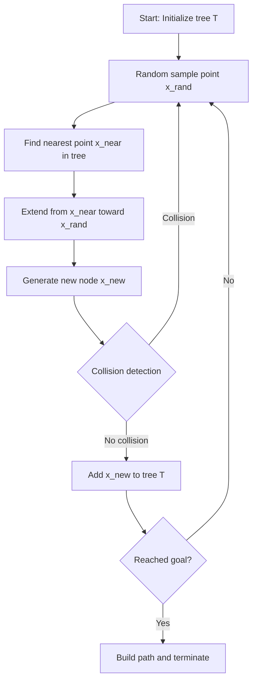
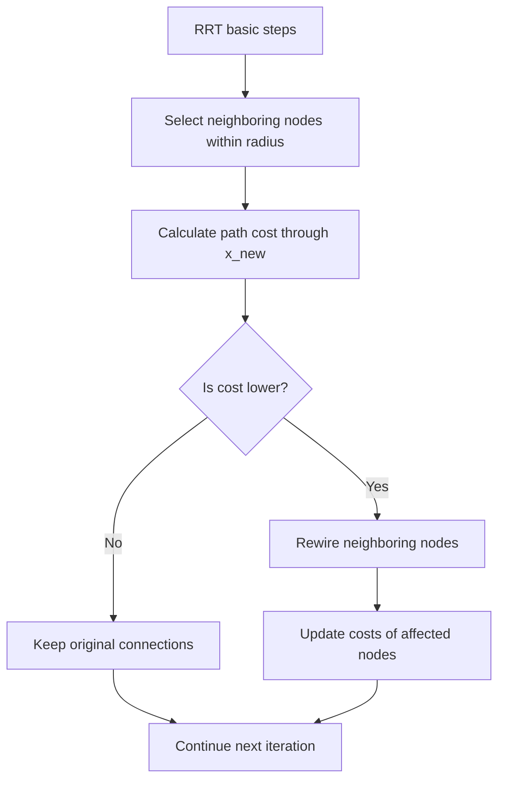
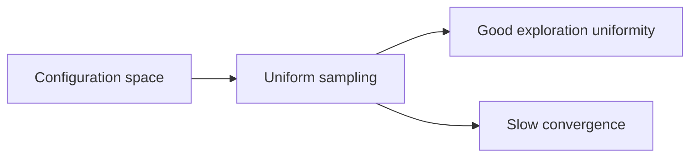
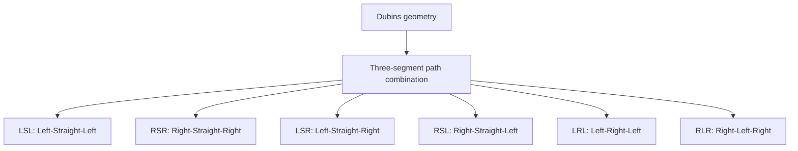
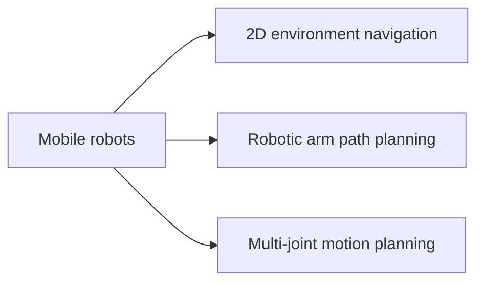
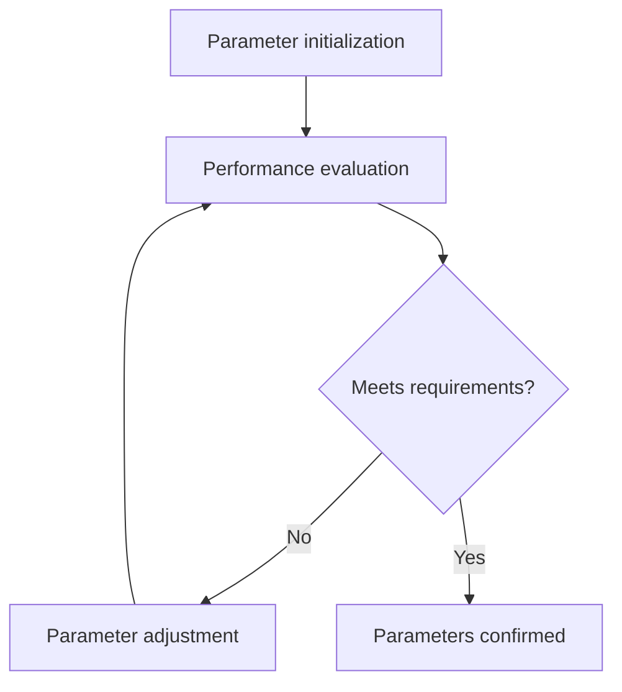

# RRT Algorithm Theoretical Foundation

## 📝 Overview

**RRT (Rapidly-exploring Random Tree)** is a sampling-based path planning algorithm proposed by Steven LaValle in 1998. The algorithm rapidly explores feasible regions by randomly sampling in the configuration space and builds a tree that expands toward the target region.

## 🧮 Core Mathematical Principles

### Algorithm Flow



### Mathematical Definition

#### Configuration Space
- **Free space**: $\mathcal{C}_{free} = \mathcal{C} \setminus \mathcal{C}_{obs}$
- **Obstacle space**: $\mathcal{C}_{obs}$ 
- **Start point**: $x_{init} \in \mathcal{C}_{free}$
- **Goal region**: $\mathcal{X}_{goal} \subset \mathcal{C}_{free}$

#### Tree Structure
Random tree $T = (V, E)$ contains:
- **Vertex set**: $V = \{x_0, x_1, ..., x_n\}$, where $x_0 = x_{init}$
- **Edge set**: $E = \{(x_i, x_j) | x_j \text{ is child of } x_i\}$

#### Key Operations

**1. Random Sampling**
```math
x_{rand} \sim \text{Uniform}(\mathcal{C}_{free})
```

**2. Nearest Neighbor Search**
```math
x_{near} = \arg\min_{x \in V} \|x - x_{rand}\|
```

**3. Steer Function**
```math
x_{new} = x_{near} + \min(\delta, \|x_{rand} - x_{near}\|) \cdot \frac{x_{rand} - x_{near}}{\|x_{rand} - x_{near}\|}
```

Where $\delta$ is the maximum extension step size.

## 🔄 RRT* Improved Algorithm

RRT* introduces a **rewiring** mechanism to gradually optimize path quality:



### RRT* Key Improvements

#### 1. Parent Selection
Select the parent with minimum cost within radius $r$:
```math
x_{parent} = \arg\min_{x \in X_{near}} \{Cost(x) + c(x, x_{new})\}
```

#### 2. Rewiring Operation  
For each node $x_{near}$ within radius, if path through $x_{new}$ is better:
```math
\text{if } Cost(x_{new}) + c(x_{new}, x_{near}) < Cost(x_{near})
```
then rewire $x_{near}$ to $x_{new}$.

#### 3. Search Radius
```math
r = \min\left\{\gamma \left(\frac{\log n}{n}\right)^{1/d}, \eta\right\}
```
Where:
- $n$ is current number of nodes
- $d$ is space dimension
- $\gamma$ is algorithm parameter
- $\eta$ is maximum search radius

## 🎯 Sampling Strategies

### 1. Uniform Random Sampling


### 2. Goal-biased Sampling
Sample goal point directly with probability $p$:
```python
if random() < p_goal:
    x_rand = x_goal
else:
    x_rand = uniform_sample()
```

### 3. Heuristic Sampling
Adjust sampling strategy based on current tree distribution:
- **Voronoi bias**: Bias toward sparse regions
- **RRT-Connect**: Bidirectional growth
- **Informed RRT***: Utilize elliptical heuristic regions

## 🚁 Dubins Path Constraints

For scenarios with minimum turning radius constraints like aircraft:



### Dubins Path Mathematical Model
Path length with minimum turning radius $\rho$:
```math
L = \rho \cdot |\theta_1| + d + \rho \cdot |\theta_2|
```

## 📊 Complexity Analysis

### Time Complexity
- **RRT**: $O(n \log n)$ per iteration
- **RRT***: $O(n \log n)$ per iteration (using kd-tree)

### Space Complexity
- **Storage**: $O(n)$
- **Nearest neighbor query**: $O(\log n)$ (kd-tree)

### Convergence Properties
- **RRT**: Probabilistic Completeness
- **RRT***: Asymptotic Optimality

## ⚖️ Algorithm Comparison

| Feature | RRT | RRT* | A* |
|---------|-----|------|-----|
| Completeness | Probabilistic | Probabilistic | Complete |
| Optimality | ❌ | Asymptotic | Optimal |
| Space requirement | Low | Medium | High |
| High-dimensional | ✅ | ✅ | ❌ |
| Dynamic environment | ✅ | ✅ | ❌ |

## 🎮 Practical Application Scenarios

### 1. Robot Path Planning


### 2. Aerospace
- **UAV path planning**: 3D environment obstacle avoidance
- **Trajectory optimization**: Considering wind field effects
- **Formation flying**: Multi-agent coordination

### 3. Autonomous Driving
- **Parking planning**: Maneuvering in narrow spaces
- **Lane changing**: Dynamic traffic environment
- **Path smoothing**: Comfort optimization

## 🔧 Parameter Tuning Guide

### Key Parameters
1. **Step size δ**: Affects exploration precision and speed
2. **Goal bias probability**: Balances exploration and exploitation
3. **Rewiring radius**: RRT* optimization effectiveness
4. **Maximum iterations**: Algorithm termination condition

### Tuning Strategy


---

**Next step**: Proceed to [02_Implementation](../implementation/) to view specific Python implementations.