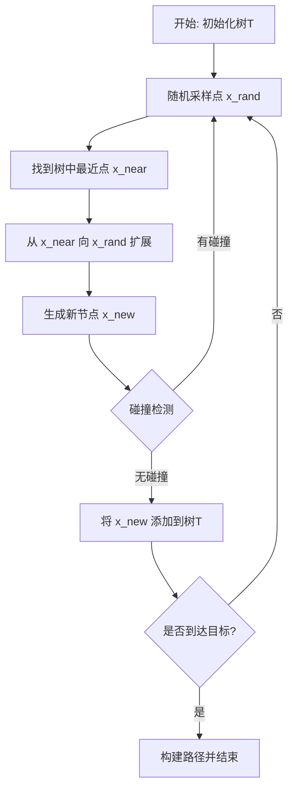
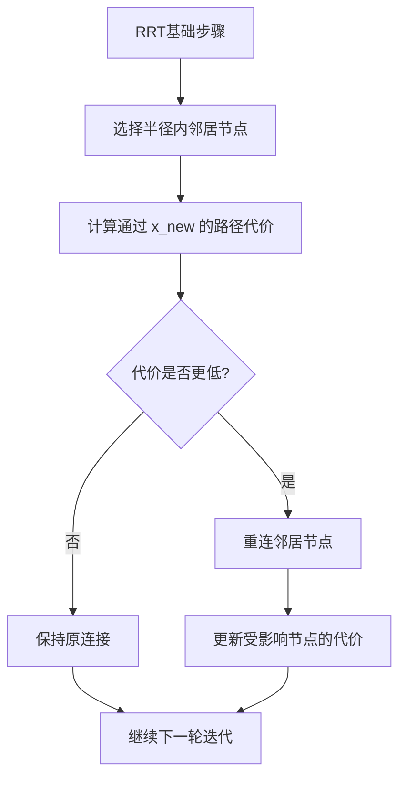
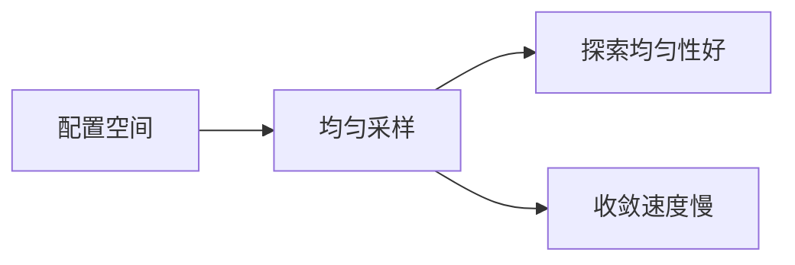
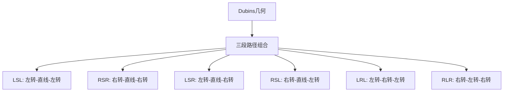
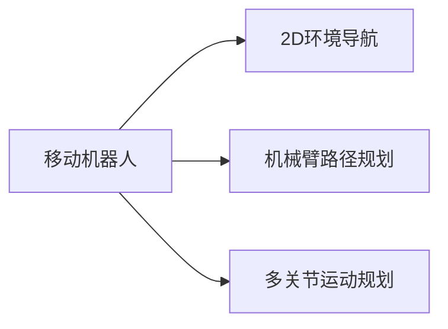
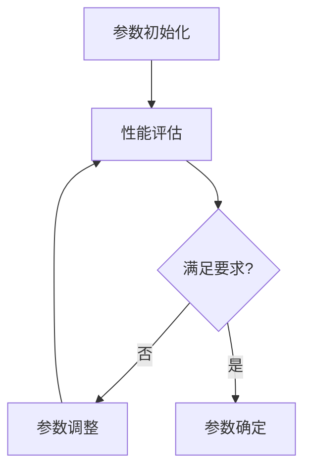

# RRT算法理论基础

## 📝 概述

**RRT (Rapidly-exploring Random Tree)** 是一种基于采样的路径规划算法，由Steven LaValle在1998年提出。该算法通过在配置空间中随机采样来快速探索可行区域，构建一棵向目标区域扩展的树。

## 🧮 核心数学原理

### 算法流程



### 数学定义

#### 配置空间 (Configuration Space)
- **自由空间**: $\mathcal{C}_{free} = \mathcal{C} \setminus \mathcal{C}_{obs}$
- **障碍空间**: $\mathcal{C}_{obs}$ 
- **起始点**: $x_{init} \in \mathcal{C}_{free}$
- **目标区域**: $\mathcal{X}_{goal} \subset \mathcal{C}_{free}$

#### 树结构
随机树 $T = (V, E)$ 包含：
- **顶点集**: $V = \{x_0, x_1, ..., x_n\}$，其中 $x_0 = x_{init}$
- **边集**: $E = \{(x_i, x_j) | x_j \text{ 是 } x_i \text{ 的子节点}\}$

#### 关键操作

**1. 随机采样 (Random Sampling)**
```math
x_{rand} \sim \text{Uniform}(\mathcal{C}_{free})
```

**2. 最近邻搜索 (Nearest Neighbor)**
```math
x_{near} = \arg\min_{x \in V} \|x - x_{rand}\|
```

**3. 扩展操作 (Steer Function)**
```math
x_{new} = x_{near} + \min(\delta, \|x_{rand} - x_{near}\|) \cdot \frac{x_{rand} - x_{near}}{\|x_{rand} - x_{near}\|}
```

其中 $\delta$ 是最大扩展步长。

## 🔄 RRT* 改进算法

RRT*引入了**重连(Rewire)**机制以逐渐优化路径质量：



### RRT*关键改进

#### 1. 选择父节点
在半径 $r$ 内选择代价最小的父节点：
```math
x_{parent} = \arg\min_{x \in X_{near}} \{Cost(x) + c(x, x_{new})\}
```

#### 2. 重连操作  
对于半径内的每个节点 $x_{near}$，如果通过 $x_{new}$ 的路径更优：
```math
\text{if } Cost(x_{new}) + c(x_{new}, x_{near}) < Cost(x_{near})
```
则重连 $x_{near}$ 到 $x_{new}$。

#### 3. 搜索半径
```math
r = \min\left\{\gamma \left(\frac{\log n}{n}\right)^{1/d}, \eta\right\}
```
其中：
- $n$ 是当前节点数
- $d$ 是空间维度
- $\gamma$ 是算法参数
- $\eta$ 是最大搜索半径

## 🎯 采样策略

### 1. 均匀随机采样


### 2. 目标偏向采样
以概率 $p$ 直接采样目标点：
```python
if random() < p_goal:
    x_rand = x_goal
else:
    x_rand = uniform_sample()
```

### 3. 启发式采样
基于当前树的分布调整采样策略：
- **Voronoi偏向**: 向稀疏区域偏向
- **RRT-Connect**: 双向增长
- **Informed RRT***: 利用椭圆启发式区域

## 🚁 Dubins路径约束

对于航空器等有最小转弯半径约束的场景：



### Dubins路径数学模型
最小转弯半径为 $\rho$ 的路径长度：
```math
L = \rho \cdot |\theta_1| + d + \rho \cdot |\theta_2|
```

## 📊 复杂度分析

### 时间复杂度
- **RRT**: $O(n \log n)$ 每次迭代
- **RRT***: $O(n \log n)$ 每次迭代 (使用kd-tree)

### 空间复杂度
- **存储**: $O(n)$
- **最近邻查询**: $O(\log n)$ (kd-tree)

### 收敛性质
- **RRT**: 概率完备 (Probabilistic Completeness)
- **RRT***: 渐进最优 (Asymptotic Optimality)

## ⚖️ 算法对比

| 特性 | RRT | RRT* | A* |
|------|-----|------|-----|
| 完备性 | 概率完备 | 概率完备 | 完备 |
| 最优性 | ❌ | 渐进最优 | 最优 |
| 空间需求 | 低 | 中等 | 高 |
| 高维适用 | ✅ | ✅ | ❌ |
| 动态环境 | ✅ | ✅ | ❌ |

## 🎮 实际应用场景

### 1. 机器人路径规划


### 2. 航空航天
- **无人机路径规划**: 3D环境避障
- **航迹优化**: 考虑风场影响
- **编队飞行**: 多智能体协调

### 3. 自动驾驶
- **泊车规划**: 狭窄空间机动
- **换道决策**: 动态交通环境
- **路径平滑**: 舒适性优化

## 🔧 参数调优指南

### 关键参数
1. **步长 δ**: 影响探索精度和速度
2. **目标偏向概率**: 平衡探索和开发
3. **重连半径**: RRT*优化效果
4. **最大迭代次数**: 算法终止条件

### 调优策略


---

**下一步**: 进入 [02_代码实现](../02_代码实现/) 查看具体的Python实现。 