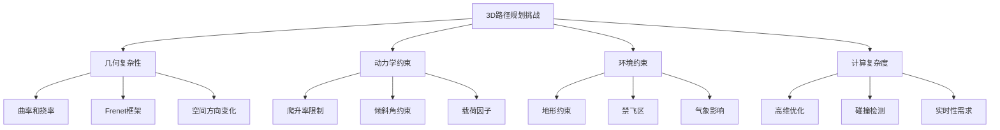
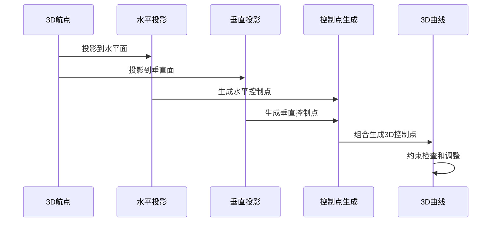
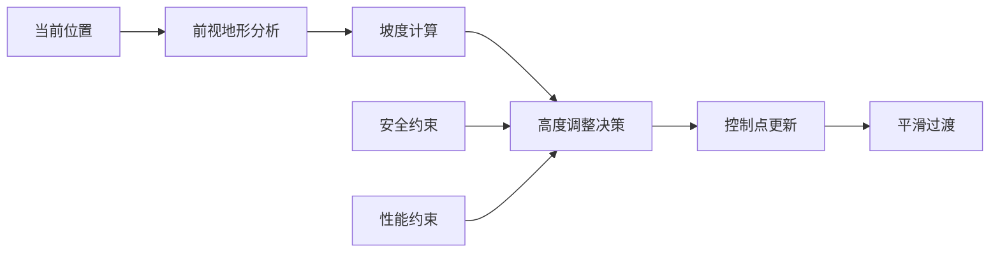

# 3D Bezier曲线路径规划理论扩展

## 概述

将Bezier曲线路径规划从2D平面扩展到3D空间，是无人机和其他飞行器在真实三维环境中进行路径规划的必要步骤。3D扩展不仅需要考虑平面内的约束，还要处理垂直方向的动力学特性和环境约束。

## 1. 3D空间的数学表达

### 1.1 3D Bezier曲线定义

在三维空间中，Bezier曲线的数学表达式扩展为：

$$\mathbf{B}(t) = \sum_{i=0}^{n} \binom{n}{i} (1-t)^{n-i} t^i \mathbf{P}_i, \quad t \in [0,1]$$

其中 $\mathbf{P}_i = [x_i, y_i, z_i]^T$ 是三维控制点。

对于三次Bezier曲线：

$$\mathbf{B}(t) = (1-t)^3 \mathbf{P}_0 + 3(1-t)^2 t \mathbf{P}_1 + 3(1-t) t^2 \mathbf{P}_2 + t^3 \mathbf{P}_3$$

### 1.2 分量表示

$$
\begin{cases}
x(t) = (1-t)^3 x_0 + 3(1-t)^2 t x_1 + 3(1-t) t^2 x_2 + t^3 x_3 \\
y(t) = (1-t)^3 y_0 + 3(1-t)^2 t y_1 + 3(1-t) t^2 y_2 + t^3 y_3 \\
z(t) = (1-t)^3 z_0 + 3(1-t)^2 t z_1 + 3(1-t) t^2 z_2 + t^3 z_3
\end{cases}
$$

## 2. 3D路径规划的特殊挑战

### 2.1 空间几何复杂性

### 2.2 曲率和挠率

在3D空间中，除了曲率还需要考虑挠率（torsion）：

**曲率公式（3D）**：
$$\kappa(t) = \frac{\|\mathbf{r}'(t) \times \mathbf{r}''(t)\|}{\|\mathbf{r}'(t)\|^3}$$

**挠率公式**：
$$\tau(t) = \frac{(\mathbf{r}'(t) \times \mathbf{r}''(t)) \cdot \mathbf{r}'''(t)}{\|\mathbf{r}'(t) \times \mathbf{r}''(t)\|^2}$$

其中：
- $\kappa(t)$ 度量曲线在空间中的弯曲程度
- $\tau(t)$ 度量曲线偏离所在平面的程度

## 3. 固定翼无人机的3D约束

### 3.1 爬升/下降约束

垂直方向的约束更加严格：

**爬升率约束**：
$$\left|\frac{dh}{dt}\right| = \left|\frac{dz}{dt}\right| \leq V \sin(\gamma_{max})$$

其中：
- $V$ 是飞行速度
- $\gamma_{max}$ 是最大爬升角（通常5°-15°）

**爬升角度连续性**：
$$\gamma(t) = \arcsin\left(\frac{z'(t)}{\|\mathbf{r}'(t)\|}\right)$$

### 3.2 倾斜角和载荷约束

**倾斜角约束**：
$$|\phi(t)| \leq \phi_{max}$$

其中倾斜角与转弯半径和爬升率相关：
$$\tan(\phi) = \frac{V^2}{gR\cos(\gamma)}$$

**载荷因子**：
$$n = \frac{1}{\cos(\phi)\cos(\gamma)} \leq n_{max}$$

### 3.3 速度矢量约束

在3D空间中，速度矢量必须满足：

$$\mathbf{V}(t) = \mathbf{r}'(t) = [V_x(t), V_y(t), V_z(t)]^T$$

约束条件：
- 总速度：$\|\mathbf{V}(t)\| = V_{设定}$
- 垂直分量：$|V_z(t)| \leq V \sin(\gamma_{max})$

## 4. 3D控制点生成策略

### 4.1 分层控制法

将3D问题分解为水平面和垂直面：

**水平面控制点**：
按照2D方法生成 $(x, y)$ 分量的控制点

**垂直面控制点**：
在距离-高度平面 $(s, z)$ 生成控制点，其中 $s$ 是水平距离

### 4.2 直接3D优化法

直接在三维空间中优化控制点：

**目标函数**：
$$J = w_1 L + w_2 \int_0^1 \kappa^2(t) dt + w_3 \int_0^1 \tau^2(t) dt + w_4 J_{约束}$$

其中：
- $L$ 是3D路径长度：$L = \int_0^1 \|\mathbf{r}'(t)\| dt$
- $\kappa^2$ 是曲率平方积分
- $\tau^2$ 是挠率平方积分
- $J_{约束}$ 是约束违反惩罚

### 4.3 地形感知控制点

考虑地形高度的控制点生成：

$$z_{控制点} = z_{航点} + \Delta z_{安全} + f_{地形}(x, y)$$

其中：
- $\Delta z_{安全}$ 是安全高度余量
- $f_{地形}(x, y)$ 是地形高度函数

## 5. 3D路径连接与连续性

### 5.1 3D连续性条件

**C⁰连续（位置连续）**：
$$\mathbf{P}_{i,3} = \mathbf{P}_{i+1,0}$$

**C¹连续（切线连续）**：
$$\mathbf{P}_{i,3} - \mathbf{P}_{i,2} = k \cdot (\mathbf{P}_{i+1,1} - \mathbf{P}_{i+1,0})$$

**C²连续（曲率连续）**：
$$\mathbf{P}_{i,1} - 2\mathbf{P}_{i,2} + \mathbf{P}_{i,3} = k^2 \cdot (\mathbf{P}_{i+1,0} - 2\mathbf{P}_{i+1,1} + \mathbf{P}_{i+1,2})$$

### 5.2 切线方向的3D处理

在3D空间中，切线方向需要同时考虑水平和垂直方向：

**方向向量计算**：
$$\mathbf{d}_i = \alpha \cdot \frac{\mathbf{W}_{i+1} - \mathbf{W}_{i-1}}{\|\mathbf{W}_{i+1} - \mathbf{W}_{i-1}\|} + \beta \cdot \mathbf{n}_{地形}$$

其中：
- $\mathbf{W}_i$ 是第i个航点
- $\mathbf{n}_{地形}$ 是局部地形法向量
- $\alpha, \beta$ 是权重系数

## 6. 地形适应性设计

### 6.1 地形跟随模式

对于低空飞行，需要保持相对地形的恒定高度：

$$h_{相对}(t) = z(t) - z_{地形}(x(t), y(t)) = h_{设定}$$

这要求：
$$\frac{dz}{dt} = \frac{\partial z_{地形}}{\partial x} \frac{dx}{dt} + \frac{\partial z_{地形}}{\partial y} \frac{dy}{dt}$$

### 6.2 避障约束

3D障碍物避免需要考虑：

**点障碍物**：
$$\|\mathbf{r}(t) - \mathbf{O}_i\| \geq R_{安全,i}, \quad \forall t \in [0,1]$$

**区域障碍物**：
$$\mathbf{r}(t) \notin \mathcal{O}_j, \quad \forall t \in [0,1]$$

其中 $\mathcal{O}_j$ 是第j个障碍区域。

### 6.3 动态高度调整

根据地形变化动态调整飞行高度：

## 7. 计算优化策略

### 7.1 维度降低技术

**主成分分析（PCA）**：
将航点投影到主要变化方向，降低计算维度

**分层规划**：
先在主平面规划，再调整垂直分量

### 7.2 并行计算

**段并行**：
多个Bezier段可以并行计算

**评估并行**：
曲率、挠率等指标的并行评估

### 7.3 近似方法

**分段线性近似**：
在约束检查中使用分段线性近似

**自适应采样**：
根据曲率变化调整采样密度

## 8. 实际应用考虑

### 8.1 传感器限制

考虑实际传感器的限制：
- 高度计精度
- GPS水平/垂直精度
- IMU测量噪声

### 8.2 执行器约束

实际飞行器的执行器限制：
- 舵面偏转角速度限制
- 发动机推力变化率
- 飞行包线约束

### 8.3 环境影响

**风场影响**：
$$\mathbf{V}_{地速} = \mathbf{V}_{空速} + \mathbf{V}_{风}$$

**大气密度变化**：
影响升力和阻力特性

**温度梯度**：
影响发动机性能和空气密度

## 9. 验证与测试

### 9.1 仿真验证

使用高保真飞行仿真器验证：
- 6自由度动力学模型
- 真实大气环境模型
- 传感器噪声模型

### 9.2 指标评估

**路径质量指标**：
- 平滑度：曲率和挠率的积分
- 可执行性：约束满足程度
- 效率：路径长度和飞行时间

**鲁棒性指标**：
- 扰动容忍度
- 传感器噪声敏感性
- 环境变化适应性

### 9.3 实飞测试

渐进式实飞测试：
1. 简单直线段测试
2. 2D转弯测试  
3. 3D螺旋测试
4. 复杂地形测试
5. 动态障碍测试

## 10. 未来发展方向

### 10.1 自适应优化

根据飞行器状态和环境条件实时调整路径参数

### 10.2 机器学习集成

使用深度学习优化控制点选择策略

### 10.3 多机协同

扩展到多无人机编队的协同路径规划

### 10.4 不确定性处理

考虑模型不确定性和环境不确定性的鲁棒路径规划 