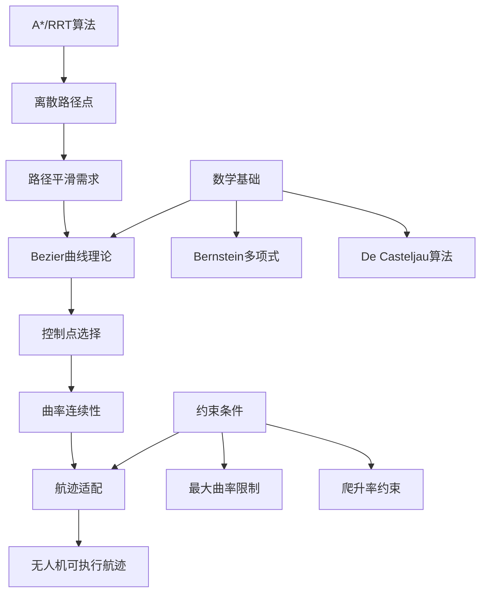

# 01_理论基础

## 模块概述

本模块介绍Bezier曲线和样条在路径规划中的理论基础，重点阐述其在无人机航迹平滑中的应用原理。

## 学习目标

- 理解Bezier曲线的数学定义和几何特性
- 掌握路径规划中的平滑性需求
- 了解Bezier曲线与其他算法的协同应用
- 认识固定翼无人机航迹约束条件

## 核心概念流程

## 关键理论点

### 1. 平滑性的重要性
- **避免尖角转弯**: 防止无人机产生过大的侧向过载
- **曲率连续**: 确保航迹的一阶和二阶导数连续
- **可执行性**: 符合飞行器动力学约束

### 2. Bezier曲线优势
- 局部控制性好
- 端点插值特性
- 凸包性质保证稳定性
- 参数化表示便于计算

### 3. 应用模式
- **后处理优化**: 对A*、RRT等算法结果进行平滑
- **混合规划**: 结合全局规划和局部平滑
- **实时调整**: 根据动态环境调整控制点

## 文件说明

- `basic_concepts.md`: 详细的数学理论和概念解释
- 下一步学习建议查看具体的概念解释文档 