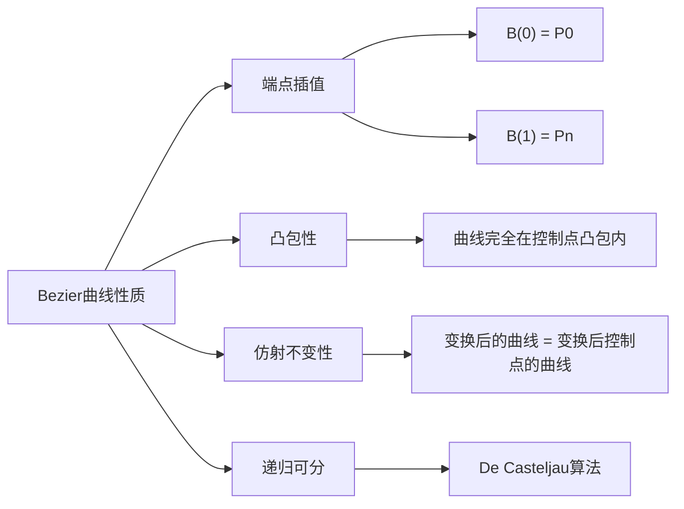
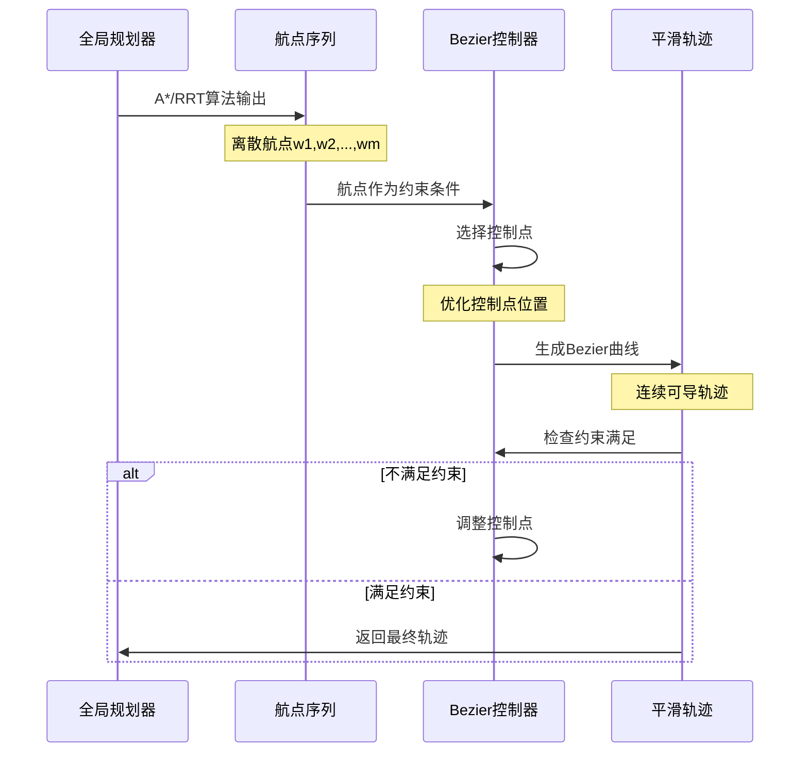
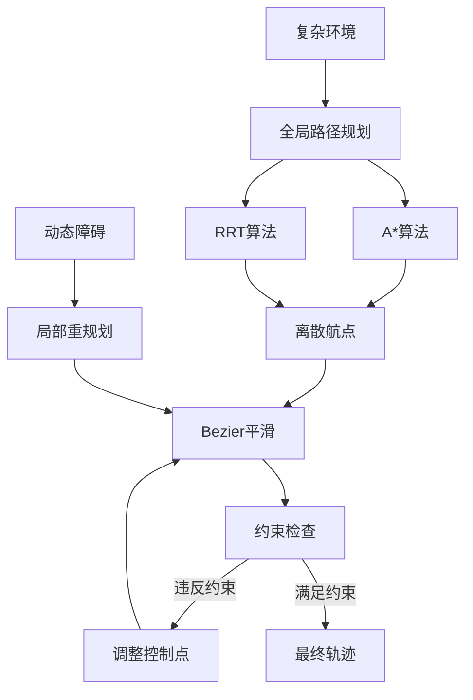

# Bezier曲线路径规划基础概念

## 1. 数学基础

### 1.1 Bezier曲线定义

Bezier曲线是一种参数曲线，由控制点定义。对于n次Bezier曲线，其数学表达式为：

$$B(t) = \sum_{i=0}^{n} \binom{n}{i} (1-t)^{n-i} t^i P_i, \quad t \in [0,1]$$

其中：
- $P_i$ 是控制点
- $\binom{n}{i}$ 是二项式系数
- $(1-t)^{n-i} t^i$ 构成Bernstein基函数

### 1.2 三次Bezier曲线（最常用）

对于三次Bezier曲线：

$$B(t) = (1-t)^3 P_0 + 3(1-t)^2 t P_1 + 3(1-t) t^2 P_2 + t^3 P_3$$

展开为矩阵形式：

$$B(t) = \begin{bmatrix} 1 & t & t^2 & t^3 \end{bmatrix} \begin{bmatrix} 1 & 0 & 0 & 0 \\ -3 & 3 & 0 & 0 \\ 3 & -6 & 3 & 0 \\ -1 & 3 & -3 & 1 \end{bmatrix} \begin{bmatrix} P_0 \\ P_1 \\ P_2 \\ P_3 \end{bmatrix}$$

### 1.3 重要性质

## 2. 路径规划中的应用

### 2.1 问题定义

在无人机路径规划中，我们通常面临：

**输入**: 一组离散航点 $W = \{w_1, w_2, ..., w_m\}$
**输出**: 平滑连续的参数化轨迹 $\gamma(t)$
**约束**: 
- 曲率限制: $|\kappa(t)| \leq \kappa_{max}$
- 速度约束: $\|\gamma'(t)\| \leq v_{max}$
- 碰撞约束: $\gamma(t) \notin \mathcal{O}$ (障碍空间)

### 2.2 典型工作流程

### 2.3 控制点选择策略

#### 策略一：端点切线法
对于连接航点 $w_i$ 和 $w_{i+1}$ 的三次Bezier曲线：
- $P_0 = w_i$ (起点)
- $P_3 = w_{i+1}$ (终点)  
- $P_1 = w_i + \alpha \cdot \vec{d_i}$ (起点切线方向)
- $P_2 = w_{i+1} - \beta \cdot \vec{d_{i+1}}$ (终点切线方向)

其中 $\vec{d_i}$ 为在 $w_i$ 处的期望切线方向，$\alpha, \beta$ 为可调参数。

#### 策略二：几何中点法
- $P_1 = w_i + \frac{1}{3}(w_{i+1} - w_i) + k \cdot \vec{n_i}$
- $P_2 = w_i + \frac{2}{3}(w_{i+1} - w_i) + k \cdot \vec{n_{i+1}}$

其中 $\vec{n_i}$ 为法向量，$k$ 为偏移系数。

## 3. 固定翼无人机特殊约束

### 3.1 曲率约束

固定翼无人机的转弯半径受限于：

$$R_{min} = \frac{v^2}{g \cdot \tan(\phi_{max})}$$

其中：
- $v$ 是飞行速度
- $g$ 是重力加速度  
- $\phi_{max}$ 是最大倾斜角

对应的曲率约束为：
$$\kappa(t) = \frac{|\gamma'(t) \times \gamma''(t)|}{|\gamma'(t)|^3} \leq \frac{1}{R_{min}}$$

### 3.2 爬升率约束

垂直方向的速度变化受限：
$$\left|\frac{dh}{dt}\right| \leq \sin(\theta_{max}) \cdot v$$

其中 $\theta_{max}$ 是最大爬升角。

### 3.3 连续性要求

为确保飞行平稳，轨迹需满足：
- **$C^0$ 连续**: 位置连续
- **$C^1$ 连续**: 速度连续（切线连续）
- **$C^2$ 连续**: 加速度连续（曲率连续）

## 4. 与其他算法的协同

### 4.1 混合架构

### 4.2 优势与局限

**优势**:
- 生成高质量平滑轨迹
- 计算复杂度相对较低
- 易于满足动力学约束
- 参数化便于后续控制

**局限**:
- 控制点选择需要经验
- 可能偏离原始路径过远
- 对复杂障碍环境适应性有限
- 局部最优问题

## 5. 实际应用考虑

### 5.1 实时性要求
- 控制点优化算法的计算复杂度
- 轨迹重新生成的频率
- 在线调整的可行性

### 5.2 鲁棒性设计
- 控制点扰动的影响分析
- 航点误差的传播控制
- 异常情况的降级策略

### 5.3 多约束优化
常见的优化目标函数：

$$J = w_1 \cdot L + w_2 \cdot \int_0^1 \kappa^2(t) dt + w_3 \cdot T + w_4 \cdot \Delta_{obs}$$

其中：
- $L$ 是路径长度
- $\int \kappa^2 dt$ 是曲率积分（平滑度）
- $T$ 是飞行时间
- $\Delta_{obs}$ 是与障碍物的安全距离
- $w_i$ 是权重系数 