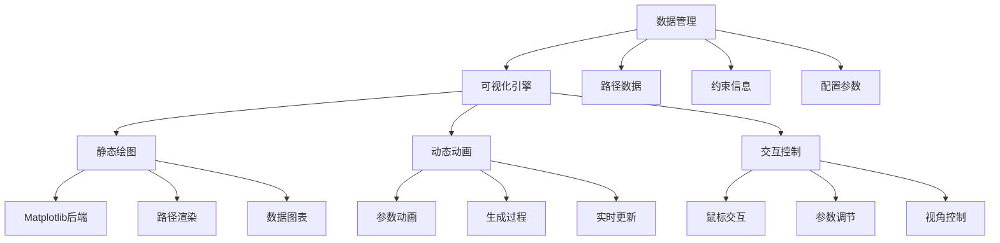

# 可视化演示指导

## 模块概述

本模块提供Bezier曲线路径规划的可视化工具，通过动态展示和交互式界面帮助理解算法的工作原理和效果。

## 可视化内容

### 1. 基础可视化
- **路径对比**: 原始折线路径 vs Bezier平滑路径
- **控制点展示**: 显示Bezier曲线的控制点和控制多边形
- **航点标注**: 清晰标识原始航点位置
- **方向指示**: 显示路径的行进方向

### 2. 动态演示
- **路径生成过程**: 展示从航点到平滑路径的生成过程
- **参数动画**: 显示参数t变化时曲线上点的移动
- **控制点调整**: 实时展示控制点变化对曲线形状的影响
- **De Casteljau过程**: 可视化递归构造过程

### 3. 约束分析
- **曲率分布图**: 沿路径的曲率变化曲线
- **速度轮廓**: 假设恒定速度下的速度分布
- **约束违反**: 高亮显示违反约束的路径段
- **安全边界**: 显示最小转弯半径对应的安全区域

### 4. 对比分析
- **多种方法对比**: 切线方法 vs 优化方法
- **参数敏感性**: 不同参数设置的效果对比
- **性能指标**: 路径长度、平滑度、计算时间等

## 技术实现

### 可视化架构



### 核心组件

#### 1. PathVisualizer类
```python
class PathVisualizer:
    """路径可视化器"""
    
    def __init__(self, figsize=(12, 8)):
        """初始化可视化器"""
        
    def plot_waypoints(self, waypoints, style='ro-'):
        """绘制航点"""
        
    def plot_bezier_path(self, path, style='b-', num_points=100):
        """绘制Bezier路径"""
        
    def plot_control_points(self, segments, show_polygon=True):
        """绘制控制点和控制多边形"""
        
    def plot_curvature_distribution(self, path):
        """绘制曲率分布"""
        
    def animate_path_generation(self, waypoints, method='tangent'):
        """动画展示路径生成过程"""
```

#### 2. InteractiveDemo类
```python
class InteractiveDemo:
    """交互式演示"""
    
    def __init__(self):
        """初始化交互界面"""
        
    def create_parameter_sliders(self):
        """创建参数调节滑块"""
        
    def update_path(self, *args):
        """实时更新路径"""
        
    def mouse_click_handler(self, event):
        """鼠标点击事件处理"""
```

### 可视化特性

#### 1. 颜色编码
- **红色**: 原始航点
- **蓝色**: 切线方法生成的路径
- **绿色**: 优化方法生成的路径
- **橙色**: 控制点
- **灰色**: 控制多边形
- **彩色渐变**: 曲率分布（蓝色=低曲率，红色=高曲率）

#### 2. 线型和标记
- **实线**: 最终路径
- **虚线**: 中间过程或对比路径
- **点线**: 约束边界
- **圆点**: 航点
- **十字**: 控制点
- **箭头**: 方向指示

#### 3. 动画效果
- **淡入淡出**: 路径段的逐步显示
- **滑动**: 参数t变化时点的移动
- **闪烁**: 重要信息的提醒
- **缩放**: 局部细节的放大展示

## 使用方法

### 基本用法
```python
from visualizer import PathVisualizer
from core_algorithm import PathPlanner, Point, Constraints

# 创建可视化器
viz = PathVisualizer()

# 定义航点
waypoints = [Point(0, 0), Point(3, 2), Point(7, 1), Point(10, 4)]

# 生成路径
planner = PathPlanner()
path = planner.generate_smooth_path(waypoints)

# 可视化
viz.plot_comparison(waypoints, path)
viz.show()
```

### 交互式演示
```python
from visualizer import InteractiveDemo

# 启动交互式演示
demo = InteractiveDemo()
demo.run()
```

### 动画演示
```python
# 生成动画
viz.animate_path_generation(waypoints, save_gif=True, filename='bezier_animation.gif')

# 参数敏感性分析
viz.parameter_sensitivity_analysis(waypoints, param_range=[0.1, 0.5, 0.9])
```

## 可视化场景

### 场景1：基础路径规划
- **目标**: 展示从离散航点到平滑路径的转换
- **内容**: 航点、控制点、最终路径
- **重点**: 平滑性效果对比

### 场景2：约束分析
- **目标**: 验证路径是否满足飞行器约束
- **内容**: 曲率分布、速度分布、约束违反区域
- **重点**: 约束满足情况

### 场景3：算法对比
- **目标**: 比较不同生成方法的效果
- **内容**: 多条路径叠加显示、性能指标对比
- **重点**: 方法优劣分析

### 场景4：参数调优
- **目标**: 理解参数对路径的影响
- **内容**: 参数滑块、实时路径更新
- **重点**: 参数敏感性

### 场景5：De Casteljau过程
- **目标**: 理解Bezier曲线的构造原理
- **内容**: 递归构造的动画过程
- **重点**: 算法原理展示

## 交互功能

### 鼠标交互
- **左键点击**: 添加新航点
- **右键点击**: 删除近的航点
- **拖拽**: 移动航点或控制点
- **滚轮**: 缩放视图

### 键盘快捷键
- **R**: 重置视图
- **S**: 保存当前图像
- **A**: 播放/暂停动画
- **C**: 切换控制点显示
- **G**: 切换网格显示

### 参数控制
- **α系数**: 控制点距离系数
- **采样密度**: 路径采样点数量
- **动画速度**: 动画播放速度
- **约束参数**: 最大曲率、最大速度等

## 输出格式

### 静态图像
- **PNG**: 高质量图像输出
- **SVG**: 矢量图像，便于编辑
- **PDF**: 适合论文和报告

### 动态内容
- **GIF**: 动画演示
- **MP4**: 高质量视频
- **HTML**: 交互式网页

### 数据导出
- **CSV**: 路径点坐标
- **JSON**: 完整配置信息
- **TXT**: 性能报告

## 性能优化

### 渲染优化
- **层次渲染**: 分层绘制不同元素
- **裁剪优化**: 只绘制可见区域
- **缓存机制**: 缓存计算结果
- **多线程**: 后台数据准备

### 内存管理
- **数据压缩**: 压缩存储路径点
- **惰性加载**: 按需加载详细数据
- **垃圾回收**: 及时清理无用对象

### 用户体验
- **进度指示**: 显示计算进度
- **错误提示**: 友好的错误信息
- **响应性**: 保持界面响应
- **跨平台**: 支持不同操作系统

## 扩展功能

### 高级可视化
- **3D显示**: 三维路径可视化
- **虚拟现实**: VR/AR展示
- **多视角**: 同时显示多个视角
- **数据叠加**: 叠加环境信息

### 分析工具
- **统计分析**: 路径质量统计
- **对比分析**: 多方案对比
- **敏感性分析**: 参数影响分析
- **优化建议**: 自动优化建议

### 导入导出
- **路径导入**: 从其他工具导入路径
- **格式转换**: 多种格式互转
- **配置共享**: 配置文件共享
- **报告生成**: 自动生成分析报告 