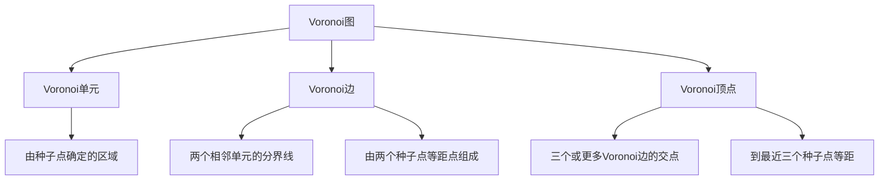
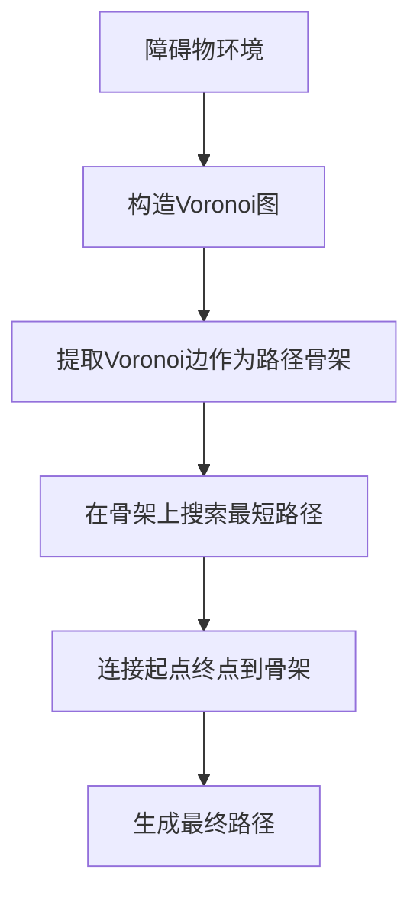

# Voronoi图基本概念

## 什么是Voronoi图？

Voronoi图（Voronoi Diagram），又称为Thiessen多边形或Dirichlet镶嵌，是一种将平面分割成若干区域的几何结构。每个区域对应一个种子点，区域内的任何点到该种子点的距离都比到其他种子点的距离更近。

## 历史背景

- **1644年**: 法国数学家René Descartes首次描述了类似概念
- **1850年**: 英国医生John Snow利用类似思想分析霍乱传播
- **1908年**: 俄国数学家Georgy Voronoy正式提出数学定义
- **现代**: 广泛应用于计算几何、路径规划、地理信息系统等领域

## 基本定义

### 欧氏距离

对于平面上两点 $A(x_1, y_1)$ 和 $B(x_2, y_2)$，欧氏距离定义为：

$$d(A, B) = \sqrt{(x_2-x_1)^2 + (y_2-y_1)^2}$$

### Voronoi单元

给定平面上一组离散点 $P = \{p_1, p_2, ..., p_n\}$（称为种子点或生成点），点 $p_i$ 的Voronoi单元定义为：

$$V(p_i) = \{x \in \mathbb{R}^2 | d(x, p_i) \leq d(x, p_j) \text{ for all } j \neq i\}$$

### Voronoi图

所有Voronoi单元的集合构成Voronoi图：

$$VD(P) = \{V(p_1), V(p_2), ..., V(p_n)\}$$

## 几何性质

### 1. 完全分割性
Voronoi图将整个平面完全分割，每个点都属于且仅属于一个Voronoi单元。

### 2. 凸性
每个Voronoi单元都是凸多边形（可能无界）。

### 3. 对偶性
Voronoi图与Delaunay三角剖分互为对偶图：
- Voronoi边的垂直平分线连接对应的Delaunay三角形顶点
- Delaunay三角形的外心是对应Voronoi顶点

## Voronoi图的构成要素

## 在路径规划中的意义

### 1. 安全通道概念

在路径规划中，障碍物被视为种子点，Voronoi边形成"安全通道"：
- **最大避障裕度**: Voronoi边上的点到最近障碍物的距离最大化
- **安全性保证**: 沿Voronoi边行进可获得最大的安全余量

### 2. 路径规划框架

## 实际应用场景

### 1. 无人机路径规划
- 将建筑物、山峰等作为障碍物种子点
- Voronoi边提供安全的飞行通道
- 特别适用于城市环境和复杂地形

### 2. 机器人导航
- 将家具、墙壁等作为障碍物
- 保证机器人与障碍物保持最大距离
- 提高导航的安全性和稳健性

### 3. 游戏AI寻路
- NPC在复杂环境中的智能移动
- 避免过于接近危险区域
- 提供自然的避障行为

## 算法复杂度

- **构造复杂度**: $O(n \log n)$ （使用Fortune算法）
- **空间复杂度**: $O(n)$
- **查询复杂度**: $O(\log n)$ （点定位）

其中 $n$ 是种子点的数量。

## 优势与局限

### 优势
1. **天然避障**: 自动保持与障碍物的最大距离
2. **计算高效**: 成熟的算法和数据结构
3. **理论完备**: 有严格的数学基础
4. **适应性强**: 适用于各种障碍物分布

### 局限
1. **路径冗余**: 可能产生不必要的绕行
2. **非最短路径**: 优先考虑安全性而非路径长度
3. **稀疏环境低效**: 在障碍物较少时过于保守
4. **动态环境适应性**: 障碍物变化时需要重新计算

## 小结

Voronoi图为路径规划提供了一个基于几何原理的优雅解决方案。通过将复杂的避障问题转化为几何计算，它能够自动生成安全的路径骨架。虽然在某些情况下会产生较长的路径，但其在安全性方面的优势使其在许多实际应用中仍然是首选方案。

在下一节中，我们将深入探讨Voronoi图的数学理论和计算方法。 